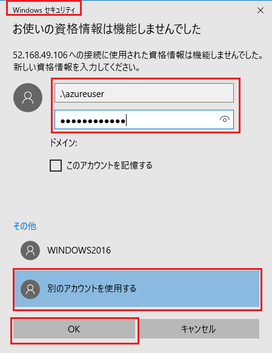

---
wts:
    title: '01 - ポータルで仮想マシンを作成する (10 分)'
    module: 'モジュール 02 - Azure のコア サービス (ワークロード)'
---
# 01 - ポータルで仮想マシンを作成する

このチュートリアルでは、Azure portal で仮想マシンを作成し、仮想マシンに接続し、Web サーバー ロールをインストールしてテストします。 

**注**: このチュートリアルでは、情報アイコンをクリックして読む時間を設けてください。 

# タスク 1: 仮想マシンを作成する (10 分)

このタスクでは、Windows Server 2019 Datacenter - Gen1 仮想マシンを作成します。 

1. [Azure portal (https://portal.azure.com)](https://portal.azure.com?azure-portal=true)にサインインします。

2. **「すべてのサービス」** ブレードで **「仮想マシン」** を検索して選択し、**「+ 追加」** をクリックして **「+ 仮想マシン」** を選びます。

3. **「基本」** タブで、次の情報を入力します (その他の情報は既定値のままにします)。

    | 設定 | 値 |
    |  -- | -- |
    | 定期売買 | **サブスクリプションを選択する**|
    | リソース グループ | **myRGVM** (新規作成) |
    | 仮想マシン名 | **myVm** |
    | 場所 | **(US) 米国東部**|
    | 画像 | **Windows Server 2019 Datacenter - Gen1**|
    | サイズ | Standard D2s v3|
    | 管理者アカウントのユーザー名 | **azureuser** |
    | 管理者アカウントのパスワード | **Pa$$w0rd1234**|
    | 受信ポートの規則 - 選択ポートを許可する | **RDP (3389)** と **HTTP (80)**|
    | | |

4. 「ネットワーク」 タブに切り替え、**「受信ポートの選択」** を検索します。

    | 設定 | 値 |
    | -- | -- |
    | 受信ポートの選択 | **HTTP (80)、RDP (3389)**|
    | | |

    **注** - ポート 80 とポート 3389 の両方が選択されていることを確認してください

5. 「管理」 タブに切り替え、**「監視」** セクションで次の設定を選択します。

    | 設定 | 値 |
    | -- | -- |
    | ブート診断 | **無効**|
    | | |

6. 残りの既定値をそのままにして、ページの下部にある **「確認および作成」** ボタンをクリックします。

7. 検証できたら、**「作成」** ボタンをクリックします。仮想マシンをデプロイするには、5 ? 7 分かかる場合があります。

8. デプロイ ページ上と **「通知」** 領域 (トップ メニューのベル アイコン) を通して更新を受信します。

* **ポート 80 とポート 3389 が開いていることを確認してください**

# タスク 2: 仮想マシンに接続する

このタスクでは、RDP を使用して新しい仮想マシンに接続します。 

1. **myVM** を検索し、新しい仮想マシンを選択します。

    **注**: デプロイ ページで **「リソースに移動」** リンクを使用するか、**「通知」** 領域でリソースにリンクすることもできます。

2. 仮想マシンの **「概要」** ブレードで、**「接続」** ボタンをクリックして **「RDP」** を選びます。

    

    **注**: 次の手順では、Windows コンピューターから VM に接続する方法を説明します。Mac では、Mac App Store にある Remote Desktop Client などの RDP クライアントが必要です。また、Linux コンピューターでは、オープンソースの RDP クライアント ソフトウェアを使用できます。

2. **「仮想マシンに接続」** ページで、ポート 3389 経由でパブリック IP アドレスから接続する既定のオプションを保持し、**「RDP ファイルのダウンロード」** をクリックします。

3. ダウンロードした RDP ファイルを**開き**、指示されたら **「接続」** をクリックします。 

    

4. **「Windows セキュリティ」** ウィンドウで **「その他」** を選択し、**「別のアカウントを使用する」** を選択します。ユーザー名 (.\azureuser) とパスワード (Pa$$w0rd1234) を入力します。**「OK」** をクリックして接続します。

    

5. サインイン プロセス中に証明書の警告が表示されることがあります。**「はい」** をクリックするか、接続を作成してデプロイした VM に接続します。正常に接続されるはずです。

    

成功しました。Azure で Windows Server 仮想マシンをデプロイして接続しました。

# タスク 3: Web サーバー ロールをインストールしてテストする

このタスクでは、サーバーに Web サーバー ロールをインストールし、既定の IIS ウェルカム ページが表示されることを確認します。

1. **「スタート」** ボタンをクリックして **「PowerShell」** と入力し、**「Windows PowerShell」** を右クリックして右クリック メニューで **「管理者として実行」** を選択し、仮想マシンで PowerShell コマンド プロンプトを開きます。

    

2. PowerShell コマンド プロンプトで次のコマンドを実行して、仮想マシンに **Web-Server** 機能をインストールします。このコマンドをコピーして貼り付けることができます。

    ```PowerShell
    Install-WindowsFeature -name Web-Server -IncludeManagementTools
    ```
  
3. 完了すると、値が **「True」** で **「成功」** を示すプロンプトが表示されます。インストールを完了するために仮想マシンを再起動する必要はありません。VM への RDP 接続を閉じます。

    

4. ポータルに戻り、myVM の **「概要」** ブレードに移動し、**「クリップボードにコピー」** ボタンを使用して myVM のパブリック IP アドレスをコピーし、新しいブラウザー タブを開いてパブリック IP アドレスを URL テキスト ボックスに貼り付け、**Enter** キーを押して閲覧します。

    

5. IIS Web サーバーの既定のウェルカム ページが開きます。

    

成功しました。パブリック IP アドレスを介してアクセスできる Web サーバーを作成しました。ホストする Web アプリケーションがある場合、アプリケーション ファイルを仮想マシンにデプロイし、デプロイされた仮想マシンでパブリック アクセス用にそれらをホストできます。


**注**: 追加コストを回避するには、このリソース グループを削除します。リソース グループを検索し、リソース グループをクリックして **「リソース グループの削除」** をクリックします。リソース グループの名前を確認し、**「削除」** をクリックします。**通知** を監視して、削除が正常に完了したことをを確認します。 
