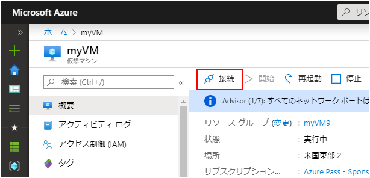
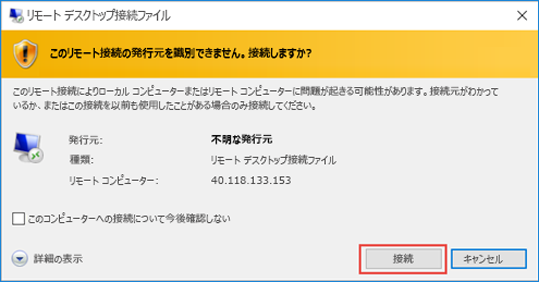
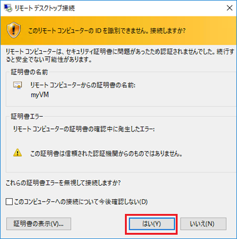
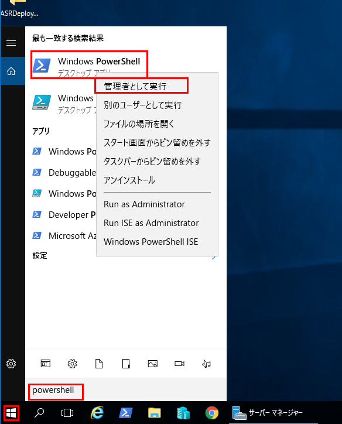
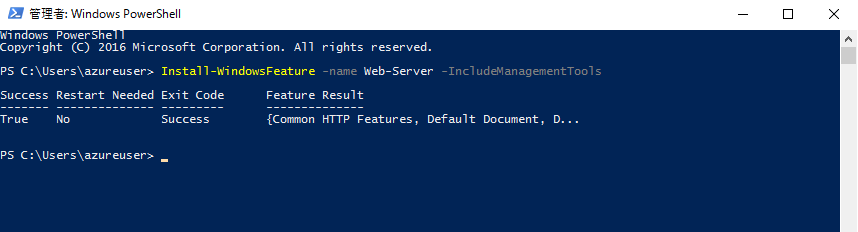
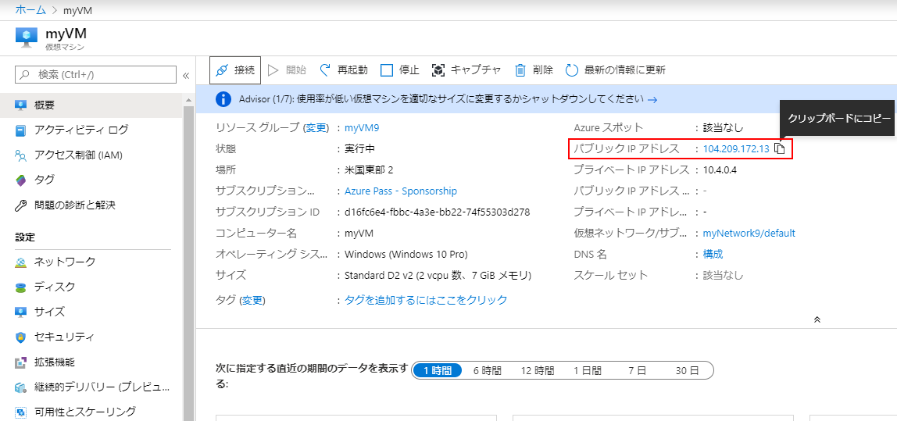
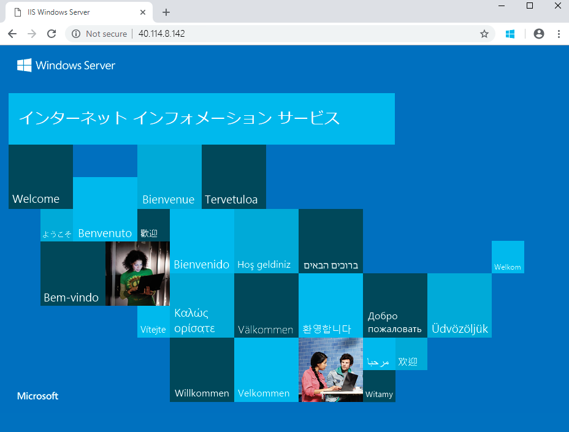

---
wts:
    title: '01 - ポータルで仮想マシンを作成する (10 分)'
    module: 'モジュール 02 - Azure のコア サービス (ワークロード)'
---
# 01 - ポータルで仮想マシンを作成する (10 分)

このチュートリアルでは、Azure portal で仮想マシンを作成し、仮想マシンに接続し、Web サーバー ロールをインストールしてテストします。 

**注**: このチュートリアルでは、情報アイコンをクリックして読む時間を設けてください。 

# タスク 1: 仮想マシンを作成する 
1. Azure portal　(**https://portal.azure.com**) にサインインします

3. 「ポータル」メニューの「**すべてのサービス**」ブレードから、「**仮想マシン**」を検索して選択し、「**+ 追加」、「+ 作成」、「+ 新規**」の順にクリックして、ドロップダウンから「**+ 仮想マシン**」を選択します。

4. 「**基本**」タブで、次の情報を入力します (その他の情報は既定値のままにします)。

    | 設定 | 値 |
    |  -- | -- |
    | サブスクリプション | **提供されている既定値を使用** |
    | リソース グループ | **新しいリソース グループの作成** |
    | 仮想マシン名 | **myVM** |
    | リージョン | **(US) East US**|
    | 可用性オプション | インフラストラクチャの冗長性オプションは必要ありません|
    | イメージ | **Windows Server 2019 Datacenter - Gen2**|
    | サイズ | **Standard D2s v3**|
    | 管理者アカウントのユーザー名 | **azureuser** |
    | 管理者アカウントのパスワード (慎重に入力してください!) | **Pa$$w0rd1234**|
    | 受信ポートの規則 - | **ポートの選択を許可する**|
    | 受信ポートの選択 | **RDP (3389)** と **HTTP (80)**| 

5. 「ネットワーク」 タブに切り替えて、「**受信ポートの選択**」 セクションで **HTTP (80) と RDP (3389)** が選択されていることを確認します。

6. 「管理」 タブに切り替え、**「監視」** セクションで次の設定を選択します。

    | 設定 | 値 |
    | -- | -- |
    | ブート診断 | **無効**|

7. 残りの値は既定値はそのままにして、ページの下部にある **「確認および作成」** ボタンをクリックします。

8. 検証できたら、「**作成**」ボタンをクリックします。仮想マシンをデプロイするには、5 ? 7 分かかる場合があります。

9. デプロイ ページ上と **「通知」** 領域 (トップ メニュー バーのベル アイコン) を通して更新を受信します。

# タスク 2: 仮想マシンに接続する

このタスクでは、RDP (リモート デスクトップ プロトコル) を使用して新しい仮想マシンに接続します。 

1. 上部の青いツール バーからベル アイコンをクリックし、展開が成功したら 「リソースに移動」 を選択します。 

    **注**: 「デプロイ」 ページの 「**リソースに移動**」 リンクを使用することもできます。 

2. 仮想マシンの **「概要」** ブレードで、**「接続」** ボタンをクリックして、ドロップダウンから **「RDP」** を選びます。

    

    **注**: 次の手順では、Windows コンピューターから VM に接続する方法を説明します。Mac では、Mac App Store にある Remote Desktop Client などの RDP クライアントが必要です。また、Linux コンピューターでは、オープンソースの RDP クライアント ソフトウェアを使用できます。

2. **「仮想マシンに接続」** ページで、ポート 3389 経由でパブリック IP アドレスから接続する既定のオプションを保持し、**「RDP ファイルのダウンロード」** をクリックします。画面の左下にファイルがダウンロードされます。

3. ダウンロードした RDP ファイル (ラボ マシンの左下にあります) を**開き**、プロンプトが表示されたら 「**接続**」 をクリックします。 

    

4. 「**Windows セキュリティ**」 ウィンドウで、VM **azureuser** の作成時に使用した管理者資格情報とパスワード **Pa$$w0rd1234** を使用してサインインします。 

5. サインイン プロセス中に証明書の警告が表示されることがあります。「**はい**」をクリックするか、接続を作成してデプロイした VM に接続します。正常に接続されるはずです。

    

新しい仮想マシン (myVM) がラボ内で起動します。ポップアップ表示されるサーバー マネージャーとダッシュボード ウィンドウを閉じます (右上の 「x」 をクリックします)。仮想マシンの青い背景が表示されます。**お疲れさまでした!** これで、Windows Server を実行している仮想マシンがデプロイおよび接続されました。 

# タスク 3: Web サーバー ロールをインストールしてテストする

このタスクでは、作成した仮想マシンのサーバーに Web サーバーのロールをインストールし、既定の IIS ウェルカム ページが表示されることを確認します。 

1. 新しく開いた仮想マシンで、検索バーで **PowerShell** を検索して PowerShell を起動します。見つかったら、**Windows PowerShell**を右クリックして**管理者として実行します**。

    

2. PowerShell で、次のコマンドを実行して、仮想マシンに **Web サーバー**機能をインストールします。(コマンドを貼り付け、Enterキーを押してインストールを開始します)。

    ```PowerShell
    Install-WindowsFeature -name Web-Server -IncludeManagementTools
    ```
  
3. 完了すると、値が **「True」** で **「成功」** を示すプロンプトが表示されます。インストールを完了するために仮想マシンを再起動する必要はありません。仮想マシンの上部中央にある青いバーの 「**x**」 をクリックして、VM への RDP 接続を閉じます。上部中央の青いバーの 「**-**」 をクリックして最小化することもできます。

    

4. ポータルに戻り、myVM の **「概要」** ブレードに移動し、**「クリップボードにコピー」** ボタンを使用して myVM のパブリック IP アドレスをコピーし、新しいブラウザー タブを開いてパブリック IP アドレスを URL テキスト ボックスに貼り付け、**Enter** キーを押して閲覧します。

    

5. IIS Web サーバーの既定のウェルカム ページが表示されます。

    

**お疲れさまでした!** パブリック IP アドレスを介してアクセスできる Web サーバーを実行する新しい VM を作成しました。ホストする Web アプリケーションがある場合、アプリケーション ファイルを仮想マシンにデプロイし、デプロイされた仮想マシンでパブリック アクセス用にそれらをホストできます。


**注**: 追加コストを回避するために、オプションでこのリソース グループを削除できます。リソース グループを検索し、リソース グループをクリックして、「**リソース グループの削除**」をクリックします。リソース グループの名前を確認し、「**削除**」をクリックします。**通知**を監視して、削除の進行状況を確認します。
