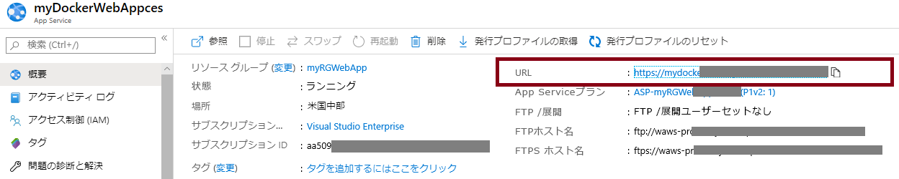
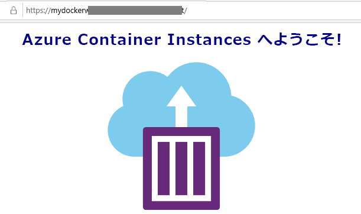

---
wts:
    title: '02 - Web アプリを作成する (10 分)'
    module: 'モジュール 02 - Azure のコア サービス (ワークロード)'
---
# 02 - Web アプリを作成する

このチュートリアルでは、Docker コンテナーを実行する新しい Web アプリを作成します。コンテナにウェルカム メッセージが表示されます。 

# タスク 1: Web アプリを作成する (10 分)

Azure App Service は、実際には 4 つのサービスのコレクションであり、そのすべてが Web アプリケーションのホストと実行を支援するために構築されています。4 つのサービス (Web アプリ、モバイル アプリ、API アプリ、ロジック アプリ) は外観が異なりますが、最終的にはすべて非常によく似た方法で動作します。Web アプリは 4 つのサービスの中で最も一般的に使用されており、このサービスはこのラボで使用するサービスです。

このタスクでは、Azure App Service Web App を作成します。 

1. [Azure portal](http://portal.azure.com/) にサインインします。 

2. **「すべてのサービス」** ブレードで、**「App Services」** を検索して選択し、**「+ 追加」** をクリックします

3. **「Web アプリ」** ブレードの **「基本」** タブで次の設定を指定します (Web アプリの名前の **xxxx** は、名前がグローバルに一意になるように文字と数字に置き換えます)。App Service プランを含む、その他すべての既定値をそのまま使用します。 

    | 設定 | 値 |
    | -- | -- |
    | サブスクリプション | **サブスクリプションを選択する** |
    | リソース グループ | **myRGWebApp1** (新規作成) |
    | 名前 | **myDockerWebAppxxxx** |
    | 発行 | **Docker コンテナー** |
    | オペレーティング システム | **Linux** |
    | リージョン | **米国東部** (サービス プランの可用性警告は無視) |
    | | |	
    
    **注意** - **xxxx** を変更し、独自の **名前** を設定しください

4. **「次へ」 > 「Docker」** をクリックし、コンテナー情報を構成します。startup コマンドはオプションで、この演習では必要ありません。 

    **注記:** これは、hello world メッセージを表示するために Container Instances のチュートリアルで使用したのと同じコンテナーです。 

    | 設定 | 値 |
    | -- | -- |
    | オプション | **単一コンテナ** |
    | イメージのソース | **Docker Hub** |
    | アクセスの種類 | **Public** |
    | 画像とタグ | **microsoft/aci-helloworld** |
    | | |	

5. **「レビューと作成」** をクリックし、**「作成」** をクリックします。 

# タスク 2: Web アプリをテストする

このタスクでは、Web アプリをテストします。

1. Web アプリがデプロイされるのを待ちます。

2. **「通知」** の **「リソースに移動」** をクリックします。 

3. **「概要」** ブレードで **URL** エントリを見つけます。 

    

4. **URL** をクリックして新しいブラウザー タブを開くと、「Azure Container Instances へようこそ」の ページが表示されます。

    

5. Web アプリの **「概要」** ブレードに戻り、いくつかのグラフが含まれていることに注意してください。手順 4 を数回繰り返す場合は、対応する製品利用統計情報がグラフに表示されます。これには、要求数と平均応答時間が含まれます。 

**注**: 追加コストを回避するには、このリソース グループを削除します。リソース グループを検索し、リソース グループをクリックして、**「リソース グループの削除」** をクリックします。リソース グループの名前を確認し、**「削除」** をクリックします。**通知**を監視して、削除の進行状況を確認します。

