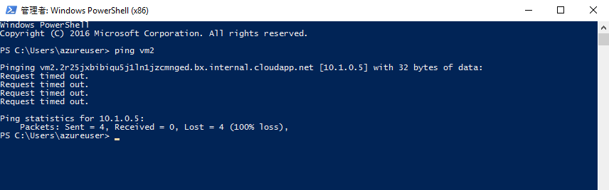

---
wts:
    title: '03 - 仮想ネットワークを作成する'
    module: 'モジュール 02 - コア Azure サービス'
---
# 03 - 仮想ネットワークを作成する

このチュートリアルでは、仮想ネットワークを作成し、その仮想ネットワークに 2 台の仮想マシンをデプロイして、その仮想ネットワーク経由で一方の仮想マシンから他方の仮想マシンに ping を実行できるように構成します。

推定時間: 45 分

# タスク 1: 仮想ネットワークを作成する

このタスクでは、新しい仮想ネットワークを作成します。 

1. <a href="https://portal.azure.com" target="_blank"><span style="color: #0066cc;" color="#0066cc">https://portal.azure.com</span></a> で Azure portal にサインインします

2. **仮想ネットワーク** を検索し、[**追加**] をクリックします。 

3. [**仮想ネットワークの作成の基本**] タブで、次の情報を入力します。

    | 設定 | 値 | 
    | --- | --- |
    | サブスクリプション | **サブスクリプションを選択します** |
    | リソース グループ | **myRGVNet** (新規作成) |
    | 名前 | **vnet1** |
    | リージョン | **米国東部** |
    | | |

4. [**IP アドレス**] タブに移動します。デフォルトを採用します。変更する必要がある場合は、IP アドレス スペースの削除アイコンを使用します。 

    | 設定 | 値 | 
    | --- | --- |
    | アドレス空間 |**10.1.0.0/16** |
    | サブネット - 名前 | **既定** |
    | サブネット アドレス範囲 | **10.1.0.0/24** |
    | | |

    ![既定のフィールドを含む [仮想ネットワーク IP アドレスの作成] タブのスクリーンショット。](../images/0301.png)

5. [**確認および作成**] ボタンをクリックします。検証に合格していることを確認します。

6. [**作成**] ボタンをクリックして、仮想ネットワークをデプロイします。 

7. 組織にとって、必要な仮想ネットワークと IP アドレスを知るにはどうすればよいでしょうか。

# タスク 2: 2 つの仮想マシンを作成する

このタスクでは、仮想ネットワークに 2 つの仮想マシンを作成します。 

1. **仮想マシン** を検索し、[**追加**] をクリックします。 

2. [**仮想マシンの作成**]  -  [**基本**] タブで、次の情報を入力または選択します。他のフィールドには既定値を使用します。 

   | 設定 | 値 | 
   | --- | --- |
   | サブスクリプション | **サブスクリプションを選択する**  |
   | リソース グループ |  **myRGVNet** |
   | 仮想マシン名 | **vm1**|
   | リージョン | **(US) 米国東部** |
   | イメージ | 既定の [**Windows Server 2016 Datacenter**] のままにします |
   | ユーザー名| **azureuser** |
   | パスワード| **Pa$$w0rd1234** |
   | パブリック受信ポート| [**選択したポートを許可する**] を選択します  |
   | 選択した受信ポート| **RDP** |
   |||

3. [**ネットワーク**] タブを選択します。仮想マシンが vnet1 仮想ネットワークに配置されていることを確認します。既定の設定を確認しますが、他の変更は行わないでください。 

   | 設定 | 値 | 
   | --- | --- |
   | 仮想ネットワーク | **vnet1** |
   |||

4. [**確認および作成**] を選択します。検証に合格したら、[**作成**] を選択します。デプロイの時間はさまざまに異なる可能性がありますが、通常デプロイには 3 分から 6 分かかる可能性があります。

5. デプロイを監視しますが、次の手順に進みます。 

6. 上記の手順 **2〜4** を繰り返して、2 番目の仮想マシンを作成します。別の仮想マシン名を使用し、その仮想マシンが新しい仮想ネットワークにあることを確認してください。

    | 設定 | 値 |
    | --- | --- |
    | リソース グループ | **myRGVNet** |
    | 仮想マシン名 |  **vm2** |
    | 仮想ネットワーク | **vnet1** |
    | パブリック IP | **Vm2-ip** (新規) |
    |||

7. **vm2** の作成が完了したら、[**確認および作成**] をクリックして構成を検証し、正常に検証されたら、[**作成**] をクリックします。

8. 仮想マシンがデプロイされるのを待ちます。 

# タスク 3: 接続をテストする 

このタスクでは、ICMP 接続を許可し、仮想マシンが相互に通信 (ping) できることをテストします。 

1. **vm1** を検索し、**ステータス** が **Running** であることを確認します。ページを **更新** する必要がある場合があります。

2. [**概要**] ブレードで、[**接続**] ボタンをクリックします。

    **注記**: 次の指示では、Windows コンピューターから VM に接続する方法を説明しています。 

3. [**仮想マシンに接続**] ページで、ポート 3389 経由で DNS 名によって接続する既定のオプションを保持し、[**RDP ファイルのダウンロード**] をクリックします。

4. ダウンロードした RDP ファイルを開き、指示されたら [**接続**] をクリックします。 

5. [**Windows セキュリティ**] ウィンドウで [**その他**] を選択し、[**別のアカウントを使用する**] を選択します。ユーザー名を **azureuser** と入力します。パスワード **Pa$$w0rd1234** を入力し、[**OK**] をクリックします。

6. サインイン プロセス中に証明書の警告が表示されることがあります。[**はい**] をクリックするか、接続を作成してデプロイした VM に接続します。正常に接続されるはずです。

7. 仮想マシンで PowerShell コマンド プロンプトを開くには、[**スタート**] ボタンをクリックし、[**PowerShell**] と入力し、メニューの [**Windows PowerShell**] を右クリックして、[**管理者として実行**] を選択します。

7. vm2 に対して ping を実行します (vm2 が実行されていることを確認します)。要求がタイムアウトしたというエラーが表示されます。  `ping` では **インターネット制御メッセージ プロトコル (ICMP)** が使用されるため、`ping` は失敗します。既定で、ICMP は Windows ファイアウォールを通過できません。


```PowerShell
ping vm2
```
   
   

**次に、vm2 に切り替え、ICMP を許可します。**

8. RDP を使用して **vm2** に接続します。手順 **2 ~ 6** を使って実行してください。

9. **PowerShell** プロンプトを開き、ICMP を許可します。このコマンドを使用すると、Windows ファイアウォール経由の ICMP の受信が許可されます。

```PowerShell
New-NetFirewallRule –DisplayName “Allow ICMPv4-In” –Protocol ICMPv4
```
    

**vm1 に切り替えて、ping を再試行します**


10. vm1 リモート セッションに戻り、ping を再試行します。これで成功するはずです。 


```PowerShell
ping vm2
```

お疲れさまでした。仮想ネットワークで 2 つの仮想マシンを構成してデプロイしました。また、仮想マシンの 1 つが ping 要求を許可するようにファイアウォールを構成しました。 

**注記**: 追加コストを回避するには、このリソース グループを削除します。リソース グループを検索し、リソース グループをクリックして、[**リソース グループの削除**] をクリックします。リソース グループの名前を確認し、[**削除**] をクリックします。**通知** を監視して、削除の進行状況を確認します。