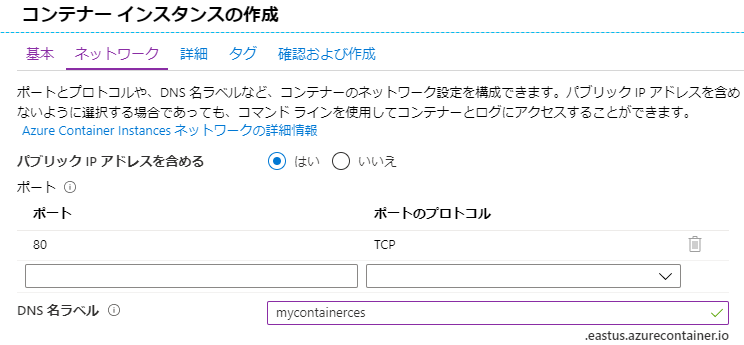
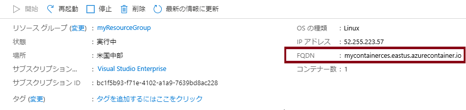
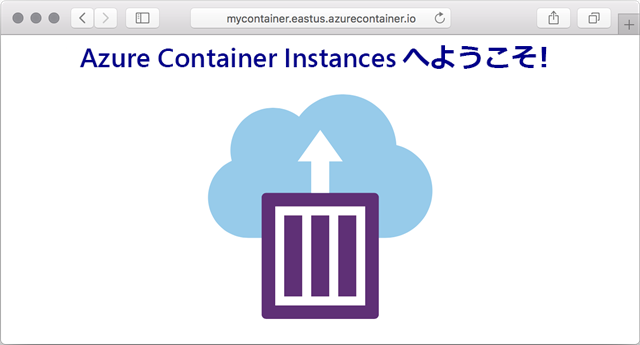

---
wts:
    title: '03 - Azure Container Instances をデプロイする (10 分)'
    module: 'モジュール 02 - Azure のコア サービス (ワークロード)'
---

# 03 - Azure Container Instances をデプロイする

このチュートリアルでは、Azure portal で Azure Container Instances (ACI) を使用して Docker コンテナーを作成、構成、デプロイします。コンテナーは、静的な HTML ページを表示する ACI Web アプリケーションへようこそです。 

# タスク 1: コンテナー インスタンスの作成 (10 分)

このタスクでは、Web アプリケーションの新しいコンテナー インスタンスを作成します。 

1. [Azure portal](https://portal.azure.com) にサインインします。

2. **「すべてのサービス」** ブレードで、**「コンテナー インスタンス」** を検索して選択し、**「+ 追加」** をクリックします 

3. 新しいコンテナー　インスタンスについて、次の基本的な詳細を入力します (その他の情報は既定値のままにします)): 

	| 設定| 値|
	|----|----|
	| サブスクリプション | **サブスクリプションを選択する** |
	| リソース グループ | **myRGContainer** (新規作成) |
	| コンテナー名| **mycontainer**|
	| リージョン | **(米国) 米国東部** |
	| イメージのソース| **Docker Hub またはその他のレジストリ**|
	| イメージの種類| **パブリック**|
	| 画像| **microsoft/aci-helloworld**|
	| OS の種類| **Linux** |
	| サイズ| ***既定値のままにします***|
	|||

4. ネットワーク タブを構成します (**xxxx** をグローバルに一意になるように文字と数字に置き換えます)。その他の設定はすべてデフォルト値のままにします。

	| 設定| 値|
	|--|--|
	| DNS 名ラベル| **mycontainerdnsxxxx** |
	|||
	
	**注**: コンテナーは、dns-name-label.region.azurecontainer.io でパブリックにアクセスできるようになります。デプロイの際に、**利用できない DNS 名ラベルです** といったエラーが表示される場合は、別のDNS 名ラベルを指定して (ただし xxxx 以外)、再度デプロイしてください。

	

5. **「確認および作成」** を選択して、自動検証プロセスを開始します。

6. **「作成」** を選択してコンテナー インスタンスを作成します。 

7. デプロイ ページと **「通知」** ページを監視します。 

8. これを待っている間に、[この単純なアプリケーションの背後にあるサンプルコード](https://github.com/Azure-Samples/aci-helloworld)を見ることが推薦されます。\app フォルダーを参照します。 

# タスク 2: コンテナー インスタンスのデプロイを確認する

このタスクでは、ウェルカム ページが表示されることを確認して、コンテナー インスタンスが実行されていることを確認します。

1. デプロイが完了したら、「デプロイ」 ブレードで **「リソースに移動」** リンクを使用するか、「通知」 領域でリソースにリンクします。

2. **mycontainer** の **「概要」** ブレードで、**状態**が**実行中**であることを確認します。 

3. 完全修飾ドメイン名 (FQDN) を見つけます。

	

2. コンテナーの FQDN を Web ブラウザーの URL テキスト　ボックスにコピーし、**Enter** を押します。ウェルカム ページが表示されます。 

	

**注**: ブラウザーでコンテナーの IP アドレスを使用することもできます。 

お疲れさまでした! Azure portal を使用して、Azure Container Instances のコンテナーにアプリケーションを正常にデプロイしました。

**注**: 追加コストを回避するには、このリソース グループを削除します。リソース グループを検索し、リソース グループをクリックして、**「リソース グループの削除」** をクリックします。リソース グループの名前を確認し、**「削除」** をクリックします。**通知**を監視して、削除の進行状況を確認します。
