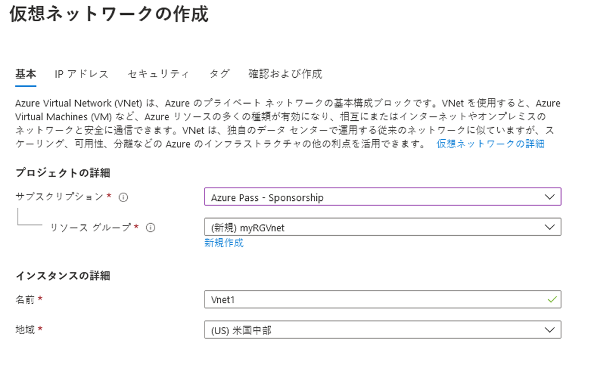
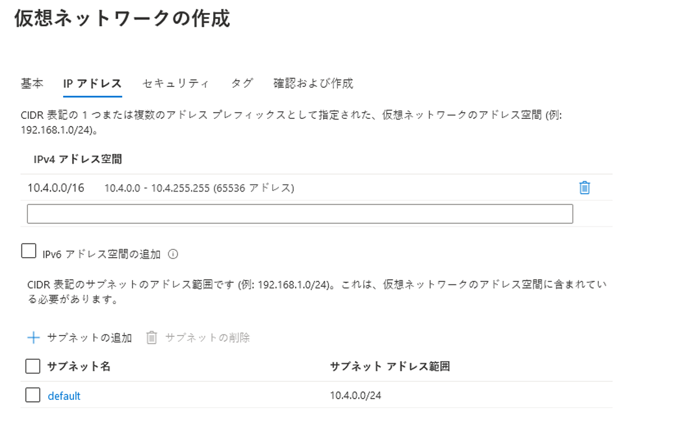

---
wts:
    title: '04 - 仮想ネットワークの作成 (20 分)'
    module: 'モジュール 02 - Azure のコア サービス (ワークロード)'
---
# 04 - 仮想ネットワークの作成

このチュートリアルでは、仮想ネットワークを作成し、その仮想ネットワークに 2 台の仮想マシンをデプロイして、仮想ネットワーク経由で一方の仮想マシンから他方の仮想マシンに ping を実行できるように設定します。

# タスク 1: 仮想ネットワークを作成する (20 分)

このタスクでは、仮想ネットワークを作成します。 

1. Azure portal <a href="https://portal.azure.com" target="_blank"><span style="color: #0066cc;" color="#0066cc">https://portal.azure.com</span></a> にサインインします。

2. 「**すべてのサービス**」 ブレードで 「**仮想ネットワーク**」 を検索して選択し、 **「+ 追加」、「+ 作成」、「+ 新規」** のいずれかをクリックします。 

3. 「**仮想ネットワークの作成**」ブレードで、以下をを入力します (その他の情報は既定値のままにします)。

    | 設定 | 値 | 
    | --- | --- |
    | サブスクリプション | **サブスクリプションを選択します** |
    | リソース グループ | **myRGVNet** (新規作成) |
    | 名前 | **vnet1** |
    | 場所 | **(米国) 米国東部** |
    | アドレス空間 |**10.1.0.0/16** |
    | サブネット - 名前 | **既定値** |
    | サブネットのアドレス範囲 | **10.1.0.0/24** |

    
    

5. 「**確認および作成**」 ボタンをクリックします。検証できたことを確認します。

6. 「**作成**」 ボタンをクリックして、仮想ネットワークをデプロイします。 

    **注**: 自分の組織では、必要な仮想ネットワークと IP アドレスはどうすればわかるでしょうか。

# タスク 2: 2 つの仮想マシンを作成する

このタスクでは、仮想ネットワークに 2 つの仮想マシンを作成します。 

1. 「**すべてのサービス**」 ブレードで 「**仮想マシン**」 を検索し、 「**+ 追加**」 をクリックして 「**+ 仮想マシン**」 を選びます。 

2. 「**基本**」タブで、次の情報を入力します (その他の情報は既定値のままにします)。

   | 設定 | 値 | 
   | --- | --- |
   | サブスクリプション | **サブスクリプションを選択する**  |
   | リソース グループ |  **myRGVNet** |
   | 仮想マシン名 | **vm1**|
   | リージョン | **(米国) 米国東部** |
   | 画像 | **Windows Server 2019 Datacenter** |
   | ユーザー名| **azureuser** |
   | パスワード| **Pa$$w0rd1234** |
   | パブリック受信ポート| 「**選択したポートを許可する**」 を選択します  |
   | 選択した受信ポート| **RDP (3389)** |
   |||

3. 「**ネットワーク**」タブを選択します。仮想マシンが vnet1 仮想ネットワークに配置されていることを確認します。既定の設定を確認しますが、他の変更は行わないでください。 

   | 設定 | 値 | 
   | --- | --- |
   | バーチャル ネットワーク | **vnet1** |
   |||

4. 「**確認および作成**」 をクリックします。検証ができたら、 「**作成**」 をクリックします。デプロイにかかる時間は場合により異なりますが、通常 3 分から 6 分かかる可能性があります。

5. デプロイを監視しながら、次の手順に進みます。 

6. 上記の手順 **2～4** を繰り返して、2 番目の仮想マシンを作成します。別の仮想マシン名を使用していて、その仮想マシンが新しい仮想ネットワークにあり、新しいパブリック IP アドレスを使用していることを確認してください。

    | 設定 | 値 |
    | --- | --- |
    | リソース グループ | **myRGVNet** |
    | 仮想マシン名 |  **vm2** |
    | バーチャル ネットワーク | **vnet1** |
    | パブリック IP | (新しい) **vm2-ip** |
    |||

7. 両方の仮想マシンがデプロイされるのを待ちます。 

# タスク 3: 接続をテストする 

このタスクでは、いずれかの VM にログインし、別の VM に対して ping を実行します。 

1. 「**すべてのリソース**」 ブレードで、**vm1** を検索して 「**概要**」 ブレードを開き、 「**状態**」 が 「**実行中**」 であることを確認します。ページを**更新**する必要がある場合があります。

2. 「**概要**」 ブレードで、 「**接続**」 ボタンをクリックします。

    **注**: 次の手順では、Windows コンピューターから VM に接続する方法を説明しています。 

3. 「**仮想マシンに接続**」 ブレードで、ポート 3389 経由で IP アドレスで接続する既定のオプションを保持し、 「**RDP ファイルのダウンロード**」 をクリックします。

4. ダウンロードした RDP ファイルを開き、指示されたら「**接続**」をクリックします。 

5. 「**Windows セキュリティ**」 ウィンドウで、ユーザー名 「**azureuser**」 とパスワード 「**Pa$$w0rd1234**」 を入力し、 「**OK**」 をクリックします。

6. サインイン プロセス中に証明書の警告が表示されることがあります。「**はい**」をクリックするか、接続を作成してデプロイした VM に接続します。正常に接続されるはずです。

7. 仮想マシンで PowerShell コマンド プロンプトを開くには、 「**スタート**」 ボタンをクリックして 「**PowerShell**」 と入力し、 「**Windows PowerShell**」 を右クリックして、右クリック メニューで 「**管理者として実行**」 をクリックします。

8. Powershell に以下のコマンドを入力して vm2 への通信を試みると、操作に成功した旨が示されます。

   ```PowerShell
   ping vm2
   ```

お疲れさまでした。仮想ネットワークで 2 つの仮想マシンを構成してデプロイしました。これで、2 つの仮想マシン間で通信が可能なことを実証しました。 

**注**: 追加コストを回避するには、このリソース グループを削除します。リソース グループを検索し、リソース グループをクリックして、 「**リソース グループの削除**」 をクリックします。リソース グループの名前を確認し、 「**削除**」 をクリックします。**通知**を監視して、削除の進行状況を確認します。
