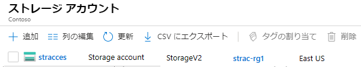
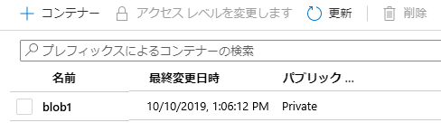
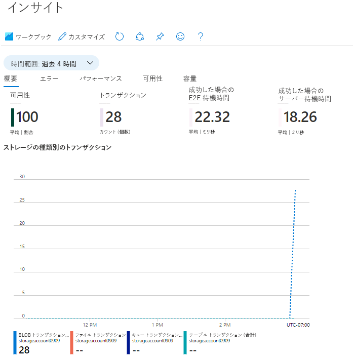

---
wts:
    title: '05 - Blob Storage を作成する (5 分)'
    module: 'モジュール 02 - Azure のコア サービス (ワークロード)'
---
# 05 - Blob Storage を作成する (5 分)

このチュートリアルでは、ストレージ アカウントを作成し、Blob Storage ファイルを操作します。

# タスク 1: ストレージ アカウントを作成する 

このタスクでは、新しいストレージ アカウントを作成します。 

1. Azure portal <a href="https://portal.azure.com" target="_blank">https://portal.azure.com</a> にサインインします。

2. 「**すべてのサービス**」ブレードで「**ストレージ アカウント**」を検索して選択し、**「+ 追加」、「+ 作成」、「+ 新規」**のいずれかをクリックします。 

3. 「**ストレージ アカウントの作成**」 ブレードの 「**基本**」 タブで次の情報を入力します (ストレージ アカウントの名前の **xxxx** は、名前がグローバルに一意になるように文字と数字に置き換えます)。その他は既定値のままにします。

    | 設定 | 値 | 
    | --- | --- |
    | サブスクリプション | **提供された既定のままにする** |
    | リソース グループ | **新しいリソース グループの作成** |
    | ストレージ アカウント名 | **storageaccountxxxxx** |
    | 場所 | **(米国) 米国東部**  |
    | 業績 | **Standard** |
    | 冗長性 | **ローカル冗長ストレージ (LRS)** |
    
    **注** -  **xxxxx** を変更して、一意の **ストレージ アカウント名** となるようにしてください

5. 「**確認および作成**」 をクリックして、ストレージ アカウントの設定を確認し、Azure が構成を検証できるようにします。 

6. 検証できたら、 「**作成**」 をクリックしますアカウントが正常に作成されたことを示す通知を待ちます。 

7. 「ホーム」ページで、 「**ストレージ アカウント**」 を検索し、新しいストレージ アカウントがリストアップされていることを確認します。

    

# タスク 2: Blob Storage を操作する

このタスクでは、BLOB コンテナーを作成し、BLOB ファイルをアップロードします。 

1. 新しいストレージ アカウントの名前をクリックし、左側のメニューの「**データ ストレージ**」セクションまでスクロールして「**コンテナー**」をクリックします。

2. 「**+ コンテナー**」をクリックして、情報を入力します。詳細については、「情報」アイコンを参照してください。完了したら、「**作成**」をクリックします。

    | 設定 | 値 |
    | --- | --- |
    | 名前 | **container1**  |
    | パブリック アクセス レベル| **非公開 (匿名アクセスなし)** |
  

    

4. 新しいブラウザー ウィンドウを開き、**Bing**　で花の画像を検索します。画像を右クリックして VM に保存します。 

6. ポータルに戻り、**container1** をクリックして、[**アップロード**] を選択します。

5. ローカル コンピューターに保存したばかりの画像ファイルを参照します。これを選択してから、[アップロード] を選択します。

   
6. 「**詳細設定**」矢印をクリックし、既定値のままにしますが、使用可能なオプションを確認してから、「**アップロード**」を選択します。

    **注**: この方法で、必要な数の BLOB をアップロードできます。新しい BLOB がコンテナー内に一覧表示されます。

7. ファイルがアップロードされたら、ファイルを右クリックして、「表示/編集」、「ダウンロード」、「プロパティ」、「削除」などのオプションを確認します。 

8. 時間がある場合は、ファイル、テーブル、キューのオプションを確認してください。

# タスク 3: ストレージ アカウントを監視する

1. ストレージ アカウント ブレードに戻り、「**問題に診断と解決**」をクリックします。 

2. 一般的なストレージの問題を調べます。ここには複数のトラブルシューティング ツールがあることに注意してください。

3. ストレージ アカウントのブレードで、 「**監視**」 セクションまでスクロールして 「**Insights**」 をクリックします。障害、パフォーマンス、可用性、容量に関する情報があることを確認します。環境によって情報は異なります。

    

お疲れさまでした。ここでは、ストレージ アカウントを作成し、Storage Blob を操作しました。

**注**: 追加コストを回避するには、このリソース グループを削除します。リソース グループを検索し、リソース グループをクリックして、 「**リソース グループの削除**」 をクリックします。リソース グループの名前を確認し、 「**削除**」 をクリックします。**通知**を監視して、削除の進行状況を確認します。
