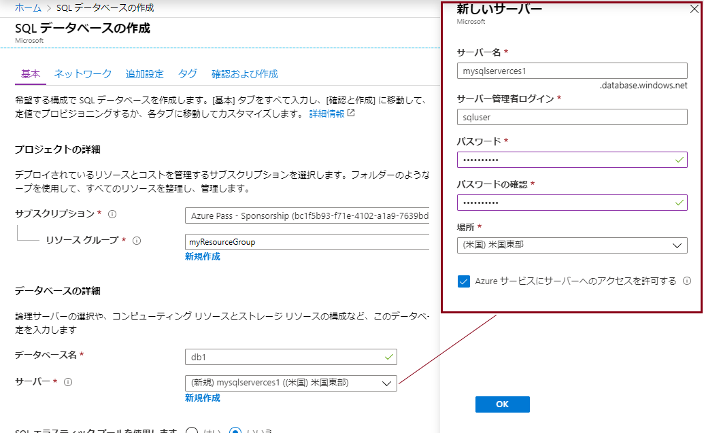
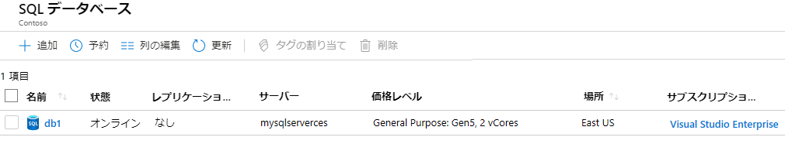
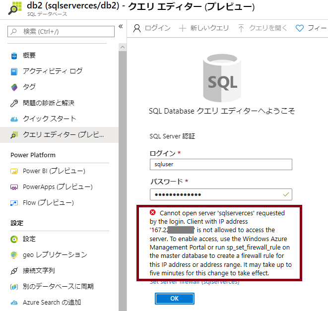
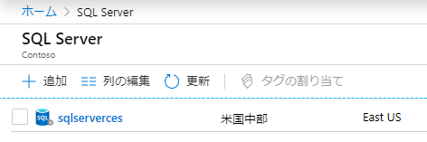
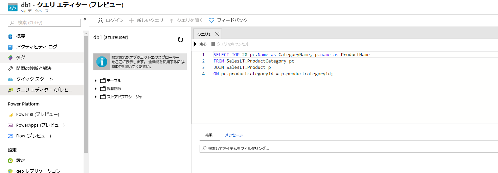
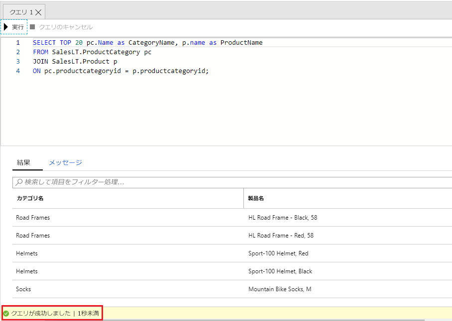

---
wts:
    title: '05 - SQL Database を作成する'
    module: 'モジュール 02 - コア Azure サービス'
---

# 05 - SQL Database を作成する

このチュートリアルでは、Azure で SQL Database を作成し、そのデータベース内のデータをクエリします。

推定時間: 25 分

# タスク 1: データベースを作成する

このタスクでは、AdventureWorksLT サンプル データベースを使用して新しい SQL データベースを作成します。 

1. <a href="https://portal.azure.com" target="_blank"><span style="color: #0066cc;" color="#0066cc">https://portal.azure.com</span></a> で Azure portal にサインインします

2. **SQL データベース** を検索して選択し、「**+追加**」 をクリックします。 

3. 「**基本**」 タブで、この情報を入力します。  

    | 設定 | 値 | 
    | --- | --- |
    | サブスクリプション | **サブスクリプションを選択する** |
    | リソース グループ | **myRGDb** (新規作成) |
    | データベース名| **db1** | 
    | | |

3. 「**サーバー**」 の横にある 「**新規作成**」 をクリックして、この情報を入力します。終了したら 「**OK**」 をクリックします。

    | 設定 | 値 | 
    | --- | --- |
    | サーバー名 | **Sqlserverxxx** (一意である必要があります) | 
    | サーバー管理者のログイン | **sqluser** |
    | パスワード | **Pa$$w0rd1234** |
    | 場所 | **(US) 米国東部** |
    | Azure サービスにサーバーへのアクセスを許可する | **チェックボックスをオンにします。** |
    | | |

   

4. 「**追加設定**」 タブに移動します。AdventureWorksLT サンプル データベースを使用します。

    | 設定 | 値 | 
    | --- | --- |
    | 既存のデータを使用する | **サンプル** | 
    | | |

5. 「**確認および作成**」 と 「**作成**」 をクリックして、リソース グループ、サーバー、およびデータベースをデプロイし、プロビジョニングします。デプロイには約 2 分から 5 分かかることがあります。

6. デプロイを監視します。 

# タスク 2: データベースをテストします。

このタスクでは、SQL サーバーを構成し、SQL クエリを実行します。 

1. **SQL データベース** を検索し、新しいデータベースが作成されたことを確認します。ページを **更新** する必要がある場合があります。

    

2. **db1** を作成したSQLデータベースを開き、 **クエリエディター (プレビュー)** を選択します。

3. ユーザー名 **sqluser**、パスワード **Pa$$w0rd1234** を使用してログインします。

4. ログインできません。エラーをよく読み、ファイアウォールを通過する必要がある IP アドレスを書き留めます。 

    

5. SQL **サーバー** を検索し、SQL サーバーを選択します。 

    

6. 「SQL サーバーの**概要**」 ブレードで、「**ファイアウォール設定を表示**」 をクリックします。

7. 「**クライアントIPの追加**」 （トップ メニューバー）をクリックし、エラー ページからIP アドレスを追加します。必ず変更を **保存** してください。 

    

8. SQL データベースとクエリ エディター (プレビュー) ログイン ページに戻ります。ユーザー名 **sqluser**、パスワード **Pa$$w0rd1234** を使用してログインします。今度は成功するはずです。新しいファイアウォール規則がデプロイされるまでに数分かかる場合があります。 

9. 正常にログインすると、クエリ ウィンドウが表示されるので、エディター ペインに次のクエリを入力します。

```SQL
    SELECT TOP 20 pc.Name as CategoryName, p.name as ProductName
    FROM SalesLT.ProductCategory pc
    JOIN SalesLT.Product p
    ON pc.productcategoryid = p.productcategoryid;
```

    

4. 「**実行**」 を選択し、「**結果**」 ウィンドウでクエリの結果を確認します。クエリは正常に実行されたはずです。

    

お疲れさまでした。Azure で SQL Database を作成し、そのデータベース内のデータを正常にクエリしました。

**注記**: 追加コストを回避するには、このリソース グループを削除します。リソース グループを検索し、リソース グループをクリックして、「**リソース グループの削除**」 をクリックします。リソース グループの名前を確認し、「**削除**」 をクリックします。**通知** を監視して、削除の進行状況を確認します。