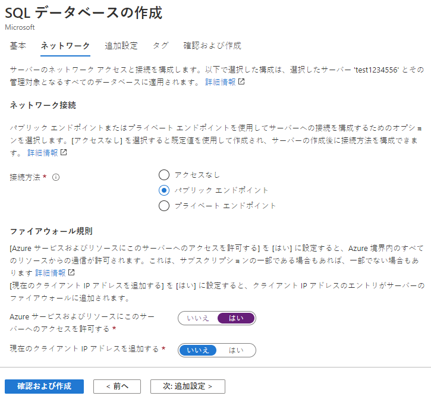
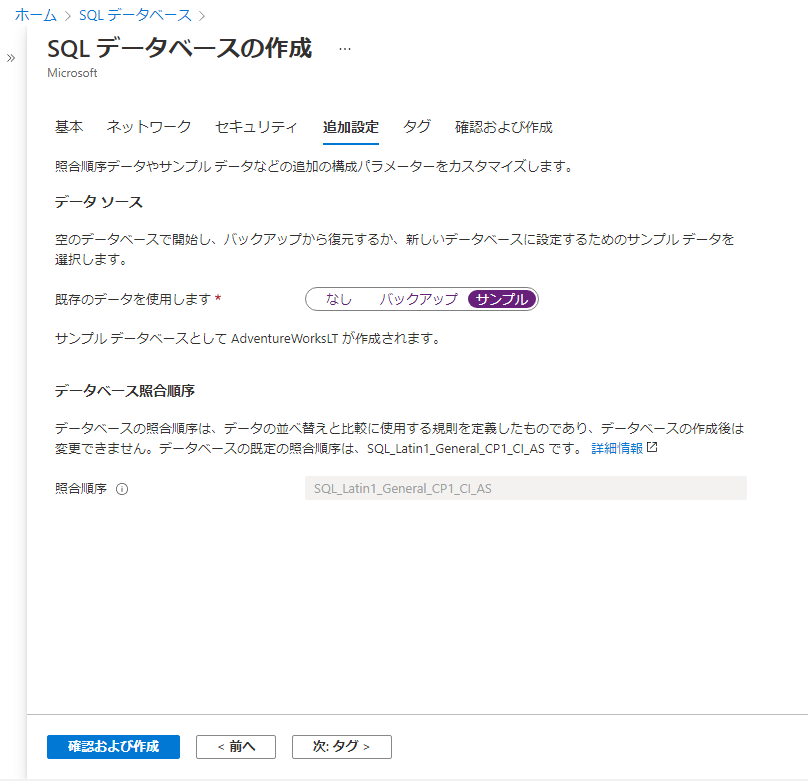

---
wts:
    title: '06 - SQL Database を作成する (5 分)'
    module: 'モジュール 02 - Azure のコア サービス (ワークロード)'
---

# 06 - SQL Database を作成する

このチュートリアルでは、Azure で SQL Database を作成し、そのデータベース内のデータをクエリします。

# タスク 1: データベースを作成する (5 分)

このタスクでは、AdventureWorksLT サンプル データベースに基づいて、SQL データベースを作成します。 

1. Azure portal [**https://portal.azure.com**](https://portal.azure.com) にサインインします。

2. **「すべてのサービス」** ブレードで、**「SQL Database」** を検索して選択し、**「+ 追加」** をクリックします。 

3. **「基本」** タブで、次の情報を入力します。  

    | 設定 | 値 | 
    | --- | --- |
    | サブスクリプション | **サブスクリプションを選択する** |
    | リソース グループ | **myRGDb** (新規作成) |
    | データベース名| **db1** | 
    | | |

3. **「サーバー」** ドロップダウン リストの横にある **「新規作成」** をクリックし、この情報を入力します (サーバー名の **xxxx** をグローバルに一意になるように文字と数字に置き換えます)。終了したら **「OK」** をクリックします。

    | 設定 | 値 | 
    | --- | --- |
    | サーバー名 | **sqlserverxxxx** (一意である必要があります) | 
    | サーバー管理者のログイン | **sqluser** |
    | パスワード | **Pa$$w0rd1234** |
    | 場所 | **(米国) 米国東部** |
    | Azure サービスにサーバーへのアクセスを許可する| ***チェックボックスを選択する*** |
    | | |

   

4. **「ネットワーク」** タブに移動し、次の設定を構成します (その他は既定値のままにしておきます)。 

    | 設定 | 値 | 
    | --- | --- |
    | 接続方法 | **パブリック エンドポイント** |    
    | Azure のサービスとリソースにこのサーバーへのアクセスを許可する | **はい** |
    | 現在のクライアント IP アドレスを追加する | **いいえ** |
    | | |
    
   

5. **「追加設定」** タブに移動します。AdventureWorksLT サンプル データベースを使用します。

    | 設定 | 値 | 
    | --- | --- |
    | 既存のデータを使用する | **サンプル** |
    | 照合 | ***既定値を使用*** |
    | 高度なデータ セキュリティを有効にする | **後で** |
    | | |

    

6. 「**レビュー + 作成**」 をクリックしてから、**「作成」** をクリックして、リソース グループ、サーバー、データベースをデプロイおよびプロビジョニングします。デプロイには約 2 分から 5 分かかることがあります。

7. リソース タブに移動し、SQL データベースが作成されていることを確認します。最新の状態に更新することが必要な場合があります。

# タスク 2: データベースをテストする。

このタスクでは、SQL サーバーを構成し、SQL クエリを実行します。 

1. **「すべてのサービス」** ブレードで、**「SQL Database」** を検索して選択し、新しいデータベースが作成されたことを確認します。ページを**更新**する必要がある場合があります。

    

2. 作成した SQL Database を表す **db1** エントリをクリックしてから、**「クエリ エディター (プレビュー)」** をクリックします。

3. ユーザー名「**sqluser**」でパスワード「**Pa$$w0rd1234**」を使用してログインします。

4. ログインすることはできません。エラーをよく読み、ファイアウォール経由で許可する必要がある IP アドレスをメモしておきます。 

    

5. **「db1」** ブレードで **「概要」** をクリックします。 

    

6. SQL サーバーの **「概要」** ブレードで、**「サーバー ファイアウォールの設定」** をクリックします。

7. **「クライアント IP の追加」** (トップ メニュー バー) をクリックし、エラーで参照されている IP アドレスを追加します。変更を必ず**保存**してください。 

    

8. SQL データベースとクエリ エディター (プレビュー) ログイン ページに戻ります。ユーザー名「**sqluser**」でパスワード「**Pa$$w0rd1234**」を使用してログインします。今度は成功するはずです。新しいファイアウォール規則がデプロイされるまでに数分かかる場合があります。 

9. 正常にログインし、クエリ ペインが表示されたら、エディター ペインに次のクエリを入力します。

    ```SQL
    SELECT TOP 20 pc.Name as CategoryName, p.name as ProductName
    FROM SalesLT.ProductCategory pc
    JOIN SalesLT.Product p
    ON pc.productcategoryid = p.productcategoryid;
    ```

    

10. **「実行」** をクリックしてから、**「結果」** ペインでクエリの結果を確認します。クエリは正常に実行されるはずです。

    

成功しました。Azure で SQL Database を作成し、そのデータベース内のデータを正常にクエリしました。

**注**: 追加コストを回避するには、このリソース グループを削除します。リソース グループを検索し、リソース グループをクリックして、**「リソース グループの削除」** をクリックします。リソース グループの名前を確認し、**「削除」** をクリックします。**通知**を監視して、削除の進行状況を確認します。
