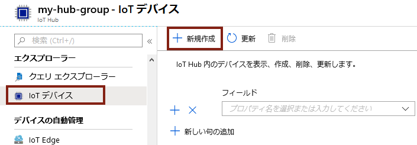
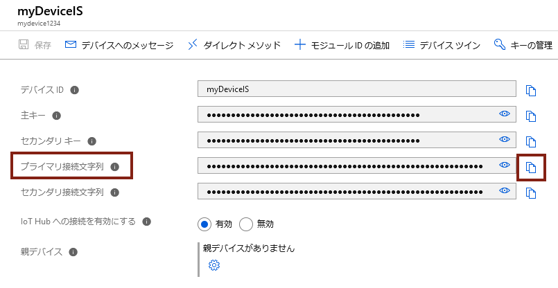
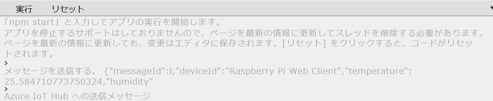
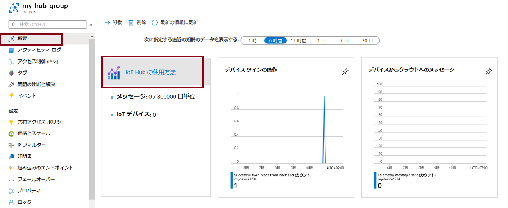

---
wts:
    title: '07 - Azure IoT Hub の実装 (10 分)'
    module: 'モジュール 03: コア ソリューションおよび管理ツールに関する説明'
---
# 07 - Azure IoT Hub の実装 (10 分)

このチュートリアルでは、Azure portal で新しい Azure IoT Hub をセットアップし、オンライン Raspberry Pi デバイス シミュレーターを使用して IoT デバイスへの接続を認証します。センサー データとメッセージが Raspberry Pi シミュレーターから Azure IoT Hub に渡されるので、Azure portal でメッセージング アクティビティのメトリックを表示します。

# タスク 1: IoT ハブを作成する 

このタスクでは、IoT ハブを作成します。 

1. [Azure ポータル](https://portal.azure.com) にサインインします。

2. 「**すべてのサービス**」ブレードで「**IoT ハブ**」を検索して選択し、**「+ 追加」、「+ 作成」、「+ 新規」**のいずれかをクリックします。

3. 「**IoT ハブ**」 ブレードの 「**基本**」 タブで、フィールドに次の詳細情報を入力します (ストレージ アカウントの名前の **xxxx** は、名前がグローバルに一意になるように文字と数字に置き換えます):

    | 設定 | 値 |
    |--|--|
    | サブスクリプション | **提供されている既定値を維持** |
    | リソース グループ | **新しいリソース グループの作成** |
    | リージョン | **米国東部** |
    | IoT Hub 名 | **my-hub-groupxxxxx** |

    **注** -  **xxxxx** を変更して、一意の **IoT Hub 名** となるようにしてください。

4. 「**管理**」タブに移動し、ドロップダウンを使って「**価格とスケール レベル**」を「**S1: Standard レベル**」に設定します。**Standard レベル**。

5. 「**確認および作成**」ボタンをクリックします。

6. 「**作成**」 ボタンをクリックして、新規 Azure IoT Hub インスタンスの作成を開始します。

7. Azure IoT Hub インスタンスがデプロイされるまで待ちます。 

# タスク 2: IoT デバイスを追加する

このタスクでは、IoT デバイスを IoT ハブに追加します。 

1. デプロイが完了したら、デプロイ ブレードで 「**リソースに移動**」 をクリックします。または、 「**すべてのサービス**」 ブレードで、 「**IoT Hub**」 を検索して選択し、新しい IoT Hub インスタンスを特定します

	

2. 新しい IoT デバイスを追加するには、「**Explorers**」セクションにスクロールして「**IoT デバイス**」をクリックします。次に、**「+ 追加」、「+ 作成」、「+ 新規」**の順にクリックします。

	

3. 新しい IoT デバイスの名前 「**myRaspberryPi**」 を入力し、 「**保存**」 ボタンをクリックします。これにより、Azure IoT Hub に新しい IoT デバイス ID が作成されます。

4. 新しいデバイスが表示されない場合は、「IoT デバイス」ページを**更新**します。 

5. 「**myRaspberryPi**」を選択し、 「**プライマリ接続文字列**」 の値をコピーします。次のタスクでこのキーを使用して、Raspberry Pi シミュレーターへの接続を認証します。

	

# タスク 3: Raspberry Pi シミュレーターを使用してデバイスをテストする

このタスクでは、Raspberry Pi シミュレーターを使用してデバイスをテストします。 

1. Web ブラウザーで新しいタブを開き、このショートカット リンク https://aka.ms/RaspPi を入力します。Raspberry Pi シミュレーター サイトに移動します。時間があれば、Raspberry Pi シミュレーターについて読んでください。完了したら、「**X**」を選択してポップアップ ウィンドウを閉じます。

2. コード領域の右側で、'const connectionString =' の行を見つけます。それを Azure portal からコピーした接続文字列で置換します。接続文字列には DeviceId (**myRaspberryPi**) と SharedAccessKey のエントリが含まれます。

	

3. 「**実行**」(コード エリアの下) をクリックして、アプリケーションを実行します。コンソール出力に、Raspberry Pi シミュレーターから Azure IoT Hub に送信されるセンサー データとメッセージが表示されるはずです。データとメッセージは、Raspberry Pi シミュレーター LEDが点滅するたびに送信されます。 

	

5. 「**停止**」をクリックするとデータ送信が停止します。

6. Azure portal に戻ります。

7. IoT Hub の「**概要**」ブレードに切り替え、「**IoT Hub 使用状況**」情報にスクロールして、使用状況を表示します。過去 1 時間のデータを表示するには、**最後の表示データ**の時間枠を変更します。

	

お疲れさまでした。IoT デバイスからセンサー データを収集するように Azure IoT Hub をセットアップしました。

**注**: 追加コストを回避するには、このリソース グループを削除します。リソース グループを検索し、リソース グループをクリックして、「**リソース グループの削除**」をクリックします。リソース グループの名前を確認し、「**削除**」をクリックします。**通知**を監視して、削除の進行状況を確認します。
