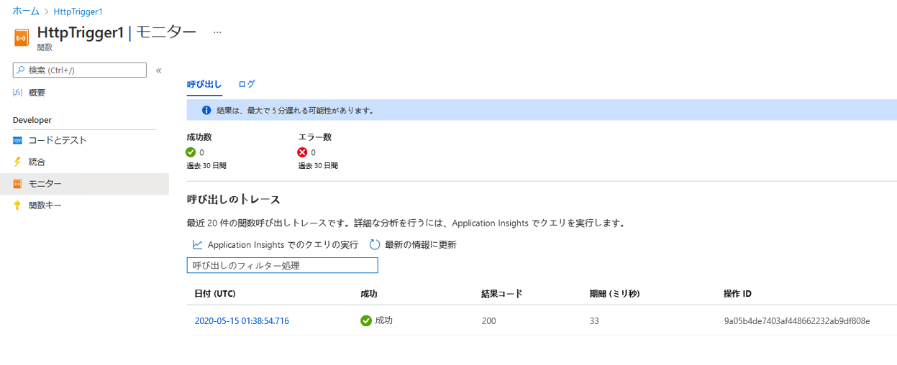

---
wts:
    title: '08 - Azure Functions の実装 (5 分)'
    module: 'モジュール 03: コア ソリューションおよび管理ツールに関する説明'
---
# 08 - Azure Functions の実装

このチュートリアルでは、HTTP 要求がある場合に Hello メッセージを表示する関数アプリを作成します。 

# タスク 1: 関数アプリを作成する (5 分)

このタスクでは、関数アプリを作成します。

1. [Azure portal](https://portal.azure.com) にサインインします。

1. ポータルの上部にある **「リソース、サービス、ドキュメントの検索」** テキストボックスで、**「関数アプリ」** を検索して選択し、**「関数アプリ」** ブレードで **「追加」** をクリックします。

1. **「関数アプリ」** ブレードの **「基本」** タブで次の設定を指定します (関数名の **xxxx** は、名前がグローバルに一意になるように文字と数字に置き換え、その他の設定はすべて既定値のままにしておきます): 

    | 設定 | 値 |
    | -- | --|
    | サブスクリプション | お使いの Azure サブスクリプションの名前 |
    | リソース グループ | 新規リソース グループの名前 **myRGFunction** |
    | 「関数アプリ名」 | **function-xxxx** |
    | 発行 | **コード** |
    | ランタイム スタック | **.NET Core** |
    | バージョン | **3.1** |
    | リージョン | **米国東部** |
    | | |

    **注** - **xxxx** を変更して、一意の **関数アプリ名** となるようにしてください

1. **「レビュー + 作成」** をクリックし、検証終了後 **「作成」** をクリックして、新しい Azure 関数アプリのプロビジョニングおよびデプロイを開始します。

1. リソースが作成されたことを示す通知を待ちます。

1. **「関数アプリ」** ブレードに戻り、**「最新の情報に更新」** をクリックして、新しく作成した関数アプリの状態が **「実行中」** であることを確認します。 

    

# タスク 2: HTTP トリガー関数を作成してテストします。

このタスクでは、Webhook + API 関数を使用して、HTTP 要求がある場合にメッセージを表示します。 

1. **「関数アプリ」** ブレードで、新しく作成した関数アプリをクリックします。 

1. 「関数アプリ」 ブレードの **「関数」** セクションで、**「関数」** をクリックしてから **「追加」** をクリックします。

    

1. **「新規関数」** ブレードの **「テンプレート」** タブで、**「HTTP トリガー」** をクリックします。 

    

1. **「新規関数」** ブレードの **「詳細」** タブで、規定の **「新規関数」** 名と **「承認レベル」** を受け入れ、**「関数の作成」** をクリックします。 

    

1. **「HttpTrigger1」** ブレードの **「開発者」** セクションで、**「コード + テスト」** をクリックします。 

1. **「HttpTrigger1」 \| 「コード + テスト」** ブレードで、自動で生成されたコードのレビューを行い、コードが HTTP 要求およびログ情報を実行する設計であることを確認します。また、この関数は名前を付けて Hello メッセージを返します。 

    

1. 関数エディターの上部セクションで **「関数の URL の取得」** をクリックします。 

1. **「キー」** ドロップダウン リストの値が **既定値** に設定されていることを確認し、**「コピー」** をクリックして関数の URL をコピーします。 

    

1. 新しいブラウザー タブを開いて、コピーした関数の URL を Web ブラウザーのアドレス バーに貼り付けます。ページが要求されると、関数を実行します。返されるメッセージには、関数に要求本文内の名前が必要であることが表示されます。

    

1. URL の末尾に **&name=*yourname*** を追加します。

    **注**: ***yourname*** を自分の名に置き換えます。たとえば、自分の名前が「Cindy」である場合、最終的な URL は `https://azfuncxxx.azurewebsites.net/api/HttpTrigger1?code=X9xx9999xXXXXX9x9xxxXX==&name=cindy` のようになります。

    

1. 関数を実行すると、呼び出しすべてがトレースされます。Azure portal でトレースを表示するには、**「HttpTrigger1」 \| 「コード + テスト」** ブレードに戻って **「監視」** をクリックします。

     

成功しました。このチュートリアルでは、HTTP 要求がある場合に Hello メッセージを表示する関数アプリを作成しました。 

**注**: 追加コストを回避するには、このリソース グループを削除します。リソース グループを検索し、リソース グループをクリックして、**「リソース グループの削除」** をクリックします。リソース グループの名前を確認し、**「削除」** をクリックします。**通知**を監視して、削除の進行状況を確認します。
