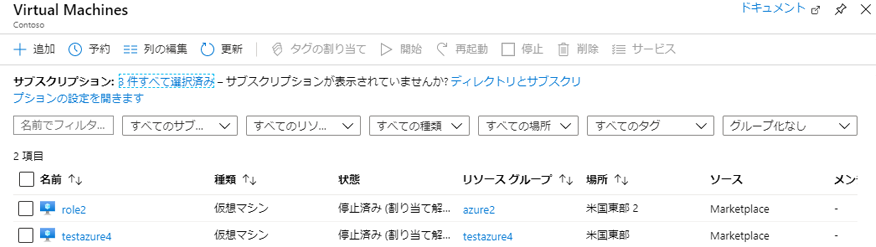
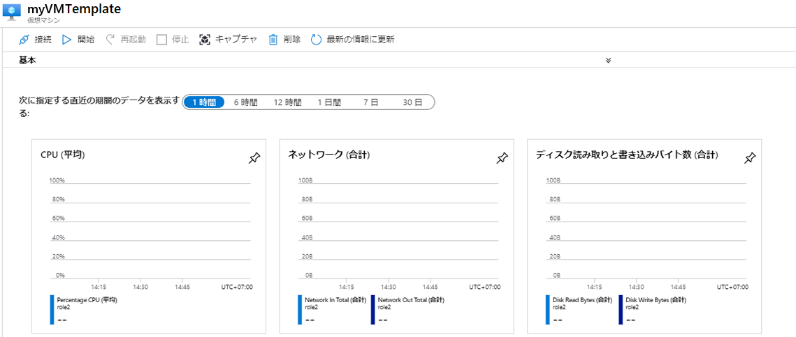
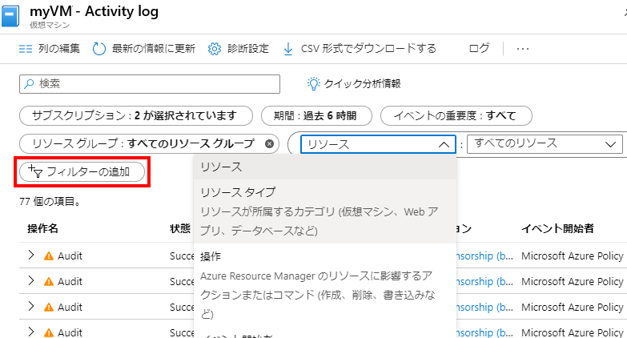

---
wts:
    title: '09 - テンプレートを使用した VM の作成 (10 分)'
    module: 'モジュール 03: コア ソリューションおよび管理ツールに関する説明'
---
# 09 - テンプレートを使用した VM の作成

このチュートリアルでは、QuickStart テンプレートを使用して仮想マシンをデプロイし、監視機能を調べます。

# タスク　1: ギャラリーを探索し、テンプレートを見つける (10 分)

このタスクでは、Azure QuickStart ギャラリーを参照し、仮想マシンを作成するテンプレートをデプロイします。 

1. ブラウザーで、[Azure QuickStart テンプレート ギャラリー](https://azure.microsoft.com/resources/templates?azure-portal=true)にアクセスします。ギャラリーには、人気のあるテンプレートや最近更新されたテンプレートが多数あります。これらのテンプレートは、一般的なソフトウェアパッケージのインストールなど、Azure リソースのデプロイを自動化します。

2. 使用できるさまざまな種類のテンプレートを参照します。 

    **注**: 興味のあるテンプレートはありますか。

3. [「仮想マシン」](https://azure.microsoft.com/resources/templates/101-vm-simple-windows?azure-portal=true) テンプレートを検索するか、直接アクセスします。

    **注**: **「Azure にデプロイ」** ボタンを使用すると、テンプレートを Azure portal に直接デプロイできます。このようなデプロイ中は、構成パラメーターの小さなセットについてのみプロンプトが表示されます。 

4. **「Azure にデプロイ」** ボタンをクリックします。ブラウザー　セッションは自動的に [Azure portal](http://portal.azure.com/) にリダイレクトされます。

5. プロンプトが表示されたら、このラボで使用する Azure サブスクリプションにサインインします。

6. **「テンプレートの編集」** をクリックします。Resource Manager テンプレート形式は、JSON 形式を使用します。パラメーターと変数を確認します。  次に、仮想マシン名のパラメーターを見つけます。名前を **myVMTemplate** に変更します。変更を**保存**します。Azure portal の **「カスタム デプロイ」** ブレードに戻ります。

    

7. **「カスタム デプロイ」** ブレードで、テンプレートに必要なパラメーターを構成します (ラベルがグローバルに一意になるように、DNS ラベルのプレフィックスの　***xxxx***　を文字と数字に置き換えます)。それ以外のすべてのものには、既定値をそのまま使用します。 

    | 設定| 値|
    |----|----|
    | サブスクリプション | **サブスクリプションを選択する**|
    | リソース グループ | **myRGTemplate** (新規作成) |
    | 場所 | **(米国) 米国東部** |
    | 管理者ユーザー名 | **azureuser** |
    | 管理者パスワード | **Pa$$w0rd1234** |
    | DNS ラベルのプレフィックス | **myvmtemplate*xxxx*** |
    | Windows OS バージョン | **2019-Datacenter** |
    | | |
    
    ** 注記: このテンプレートに関連する費用はありません。

9. **「確認および作成」** をクリックします。

10. デプロイを監視します。 

# タスク 2: 仮想マシンのデプロイを確認および監視する

このタスクでは、正しくデプロイされた仮想マシンを確認します。 

1. **「すべてのサービス」** ブレードから、**「仮想マシン」** を検索して選択します。

2. 新しい仮想マシンが作成されたことを確認します。 

    

3. 仮想マシンを選択し、**「概要」** ウィンドウを下にスクロールして監視データを表示します。

    **注**: 監視時間枠は 1 時間から 30 日に調整可能です。

4. **CPU (平均)**、**ネットワーク (合計)**、および**ディスク バイト (合計)** を含むさまざまなグラフを確認します。 

    

5. 任意のグラフをクリックします。**メトリックを追加**し、グラフの種類を変更できることに注意してください。

6. **「概要」** ブレードに戻ります。

7. **「アクティビティ ログ」** (左側のウィンドウ) をクリックします。アクティビティ ログには、リソースの作成や変更などのイベントが記録されます。 

8. **「フィルターの追加」** をクリックし、さまざまなイベントの種類と操作の検索を試行します。 

    

**注**: 追加コストを回避するには、このリソース グループを削除します。リソース グループを検索し、リソース グループをクリックして、**「リソース グループの削除」** をクリックします。リソース グループの名前を確認し、**「削除」** をクリックします。**通知**を監視して、削除の進行状況を確認します。
