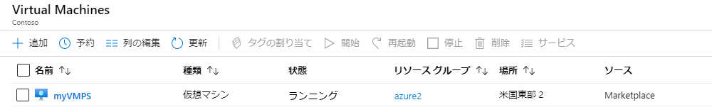
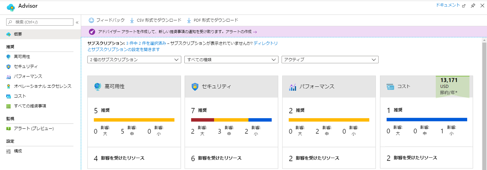
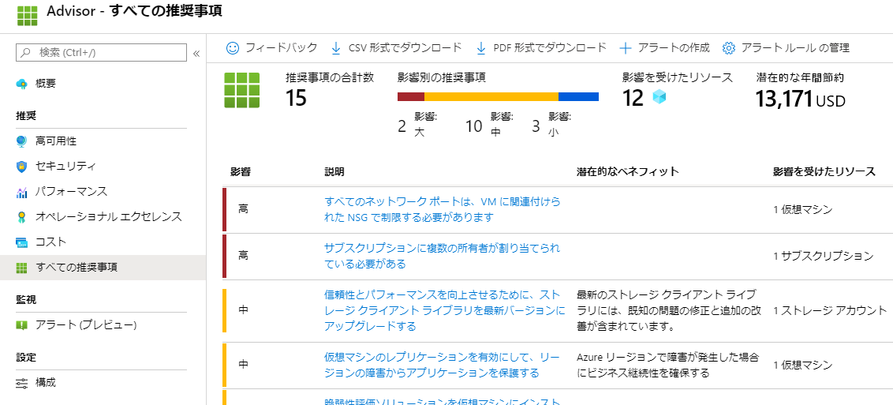

---
wts:
    title: '10 - PowerShell を使用して VM を作成する (10 分)'
    module: 'モジュール 03: コア ソリューションおよび管理ツールに関する説明'
---
# 10 - PowerShell を使用して VM を作成する (10 分)

このチュートリアルでは、Cloud Shell を構成し、Azure PowerShell モジュールを使用してリソース グループと仮想マシンを作成し、Azure Advisor の推奨事項を確認します。 

# タスク 1: Cloud Shell を設定する 

このタスクでは、Cloud Shell を構成します。 

1. [Azure portal](https://portal.azure.com) にサインインします。

2. Azure portal から、右上にあるアイコンをクリックして、**Azure Cloud Shell** を開きます。

    

3. **Bash** や **PowerShell** のどちらかを選択するプロンプトが表示されたら、**PowerShell** を選択します。

4. **「ストレージにマウントされていない」** ペインで、**「詳細設定を表示」** を選択し、以下の情報を入力します

    | 設定 | 値 |
    |  -- | -- |
    | リソース グループ | **新しいリソース グループの作成** |
    | ストレージ アカウント (グローバルに一意の名前を使用して新しいアカウントを作成します (例: cloudshellstoragemystorage)) | **cloudshellxxxxxxx** |
    | ファイル共有 (新規作成) | **shellstorage** |

5. 「**ストレージの作成**」を選択する

# タスク 2: リソース グループと仮想マシンを作成する

このタスクでは、PowerShell を使用して、リソース グループと仮想マシンを作成します。  

1. Cloud Shell ペインの左上のドロップダウン メニューで、**「PowerShell」** が選択されていることを確認します。

2. Powershell ウィンドウで次のコマンドを実行して、新しいリソース グループを確認します。**Enter** キーを押してコマンドを実行します。

    ```PowerShell
    Get-AzResourceGroup | Format-Table
    ```

3. 次のコマンドをターミナル ウィンドウに貼り付けて、仮想マシンを作成します。 

    ```PowerShell
    New-AzVm `
    -ResourceGroupName "myRGPS" `
    -Name "myVMPS" `
    -Location "East US" `
    -VirtualNetworkName "myVnetPS" `
    -SubnetName "mySubnetPS" `
    -SecurityGroupName "myNSGPS" `
    -PublicIpAddressName "myPublicIpPS"
    ```
    
4. プロンプトが表示されたら、ユーザー名 (**azureuser**) とパスワード (**Pa$$w0rd1234**) を入力します。これらは、その仮想マシンのローカル管理者アカウントとして構成されます。

5. VM が作成されたら、PowerShell セッションの CloudShell ペインを閉じます。

6. Azure portal で、**仮想マシン**を検索し、**myVMPS** が実行されていることを確認します。これには数分かかることがあります。

    

7. 新しい仮想マシンにアクセスし、「概要」 と 「ネットワーク」 の設定を確認して、情報が正しくデプロイされたことを確認します。 

# タスク 3: Cloud Shell でコマンドを実行する

このタスクでは、Cloud Shell から PowerShell コマンドを実行する練習を行います。 

1. Azure portal から、右上にあるアイコンをクリックして **Azure Cloud Shell** を開きます。

2. Cloud Shell ペインの左上のドロップダウン メニューで、**「PowerShell」** が選択されていることを確認します。

3. 名前、リソース グループ、場所、状態など、仮想マシンに関する情報を取得します。PowerState が**実行されている**ことを確認します。

    ```PowerShell
    Get-AzVM -name myVMPS -status | Format-Table -autosize
    ```

4. 次のコマンドを使用して仮想マシンを停止します。 

    ```PowerShell
    Stop-AzVM -ResourceGroupName myRGPS -Name myVMPS
    ```
5. プロンプトが表示されたら、「はい」 を選んでアクションを確認します。**成功**ステータスを待ちます。

6. 仮想マシンの状態を確認します。これで、PowerState の**割り当てが解除されます**。ポータルで仮想マシンの状態を確認することもできます。CloudShell を閉じます。

    ```PowerShell
    Get-AzVM -name myVMPS -status | Format-Table -autosize
    ```

# タスク 4: Azure Advisor の推奨事項を確認する

**注:** このタスクは、「Azure CLI ラボを使用した VM の作成」にあるタスクと同じです。 

このタスクでは、仮想マシンの Azure Advisor の推奨事項を確認します。 

1. **「すべてのサービス」** ブレードから、**「アドバイザー」** を検索して選択します。 

2. **「アドバイザー」** ブレードで、**「概要」** を選択します。通知の推奨事項は、高可用性、セキュリティ、パフォーマンス、コストごとにグループ化されています。 

    

3. **「すべての推奨事項」** を選択し、各推奨事項と推奨されるアクションを表示します。 

    **注:** リソースに応じて、推奨事項は異なります。 

    

4. 推奨事項を CSV または PDF ファイルとしてダウンロードできることを確認してください。 

5. アラートを作成できることを確認してください。 

6. 時間があれば、Azure PowerShell の試用を続けてください。 

成功しました。Cloud Shell を構成し、PowerShell を使用して仮想マシンを作成し、PowerShell コマンドで練習し、Advisor の推奨事項を確認しました。

**注**: 追加コストを回避するには、このリソース グループを削除します。リソース グループを検索し、リソース グループをクリックして、**「リソース グループの削除」** をクリックします。リソース グループの名前を確認し、**「削除」** をクリックします。**通知**を監視して、削除の進行状況を確認します。
