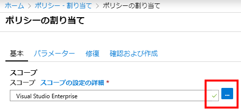
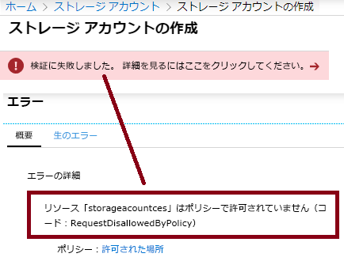

---
wts:
    title: '14 - Azure Policy の作成'
    module: 'モジュール 03 - セキュリティ、プライバシー、コンプライアンス、および信頼性'
---
# 14 - Azure Policy の作成

このチュートリアルでは、Azure リソースのデプロイを特定の場所に制限する Azure Policy を作成します。

推定時間: 20 分

# タスク 1: ポリシー割り当てを作成する

このタスクでは、許可された場所のポリシーを構成し、サブスクリプションに割り当てます。 

1. [Azure Portal](https://portal.azure.com) にサインインします。

2. [**ポリシー**] を検索して選択し、[**作成**] セクションで [**定義**] をクリックします。組み込みのポリシー定義の一覧を確認します。たとえば、[**カテゴリ**] ドロップダウンで [**計算**] のみを選択します。**許可されている仮想マシンの SKU** 定義により、組織が展開できる仮想マシン SKU のセットを指定できます。

3. [**ポリシー**] ページに戻り、[**作成**] セクションの [**割り当て**] をクリックします。割り当ては、特定のスコープ内で行われるポリシーです。たとえば、定義をサブスクリプション スコープに割り当てることができます。 

4. [**ポリシー - 割り当て**] ページの上部から [**ポリシーの割り当て**] を選択します。

5. [**ポリシーの割り当て**] ページで、省略記号をクリックしてスコープ セレクターを選択します。 

    

6. サブスクリプションが選択されていることを確認します。サブスクリプションは異なります。オプションでポリシーをリソース グループにスコープできることに注意してください。既定値のままにして、[**選択**] をクリックします。  

    **注記**: スコープは、ポリシーの割り当てが適用されるリソースまたはリソースのグループを決定します。この場合、このポリシーを特定のリソース グループに割り当てることができますが、サブスクリプション レベルでポリシーを割り当てます。また、スコープに基づいてリソースを除外できることに注意してください。除外はオプションです。

    

7. [**ポリシー定義**の省略記号] ボタンを選択します。[**検索**] ボックスに **location** と入力し、**許可された場所** の定義をクリックして、[**選択**] をクリックします。

    **注記**: この **許可された場所** のポリシー定義では、すべてのリソースを展開する場所を指定します。別の場所が選択されている場合、デプロイは許可されません。詳細については、[Azure Policy Samples](https://docs.microsoft.com/ja-jp/azure/governance/policy/samples/index) ページをご覧ください。

   ![さまざまなフィールドが強調表示され、[管理対象ディスクを使用しない VM を監査する] オプションが選択された [利用可能な定義] ウィンドウのスクリーンショット。](../images/1403.png)

8.  [**ポリシーの割り当て**] ウィンドウの [**パラメーター**] タブで、[**許可された場所**] ボックスの最後にある矢印をクリックし、次のリストから **Japan West** を選択します。他のすべての値をそのままにして、[**確認および保存**] をクリックし、[**保存**] をクリックします。

    ![[Japan West] が入力され、割り当てボタンが強調表示された場所とともにさまざまなフィールドが入力された [ポリシーの割り当て] ウィンドウのスクリーンショット。](../images/1404.png)

9. [**許可された場所**] ポリシー割り当てが [**ポリシー-割り当て**] ウィンドウに一覧表示され、指定したスコープ レベル（サブスクリプション レベル）で実施できるようになりました。

   ![許可された場所の割り当てが強調表示された [ポリシー - 割り当て] ペインのスクリーンショット](../images/1406.png)

# タスク 2: 許可された場所のポリシーをテストする

このタスクでは、許可された場所のポリシーをテストします。 

1. Azure Portal で [**ストレージ アカウント**] を検索して選択し、[**+ 追加**] をクリックします。

2. ストレージ アカウントを構成します。他の設定のデフォルトを使用します。 

    | 設定 | 値 | 
    | --- | --- |
    | サブスクリプション | **サブスクリプションを使用する** |
    | リソース グループ | **myRGPolicy** (新規作成) |
    | ストレージ アカウント名 | **storageaccountxxx** (一意である必要があります) |
    | 場所 | **(US) 米国東部** |
    | | |

3. [**確認および作成**] をクリックします。

4. 検証に失敗したメッセージが表示され、[**ここをクリックして詳細を表示する**] メッセージをクリックします。結果の **エラー** ブレードの [**概要**] タブで、エラー メッセージ、[**リソース xyz はポリシーによって許可されていません**] およびポリシー名が [**許可された場所**] というメッセージに注意してください。

    **注記**: [**Raw Error**] タブをクリックして出力を表示し、[許可された場所] ポリシーをクリックして、デプロイをブロックしたポリシーを表示することで、詳細をさらに掘り下げることができます。

    

# タスク 3: ポリシーの割り当てを削除する

このタスクでは、許可された場所ポリシーの割り当てとテストを削除します。 

ポリシーの割り当てを削除して、今後の作業がブロックされないようにします。

1. ポータルで [**ポリシー**] を検索して選択し、[**許可された場所**] ポリシーをクリックします。

2. 割り当てたさまざまなポリシーのコンプライアンス状態を表示できることに注意してください。

    **注記**: [許可された場所] ポリシーには、非準拠のリソースが表示される場合があります。その場合、これらはポリシーの割り当て前に作成されたリソースです。

3. トップメニューから [**割り当ての削除**] を選択します。

   ![[割り当ての削除] メニュー項目のスクリーンショット。](../images/1407.png)

4. [**はい**] をクリックして、[**割り当ての削除**] ダイアログでポリシー割り当てを削除することを確認します。

5. 別のストレージ アカウントを作成して、ポリシーが無効になっていることを確認してください。

    **注記**: [**許可された場所**] のポリシーが役立つシナリオには次のものがあります。 
    - *コスト トラッキング*: 地域ごとに異なるサブスクリプションを作成し、すべてのリソースがその地域にデプロイされていることを確認して、コスト トラッキングに役立てることができます。 
    - *データ常駐とセキュリティ コンプライアンス*: また、データ常駐要件を設定し、顧客ごとまたは特定のワークロードごとにサブスクリプションを作成し、すべてのリソースを特定のデータセンターにデプロイしてデータとセキュリティのコンプライアンス要件を確保することを定義することが可能です。

お疲れさまでした。Azure リソースの展開を特定のデータセンターに制限する Azure Policy を作成しました。

**注記**: 追加コストを回避するには、このリソース グループを削除します。リソース グループを検索し、リソース グループをクリックして、[**リソース グループの削除**] をクリックします。リソース グループの名前を確認し、[**削除**] をクリックします。**通知** を監視して、削除の進行状況を確認します。