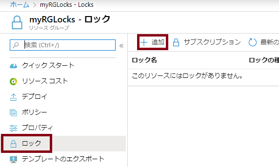
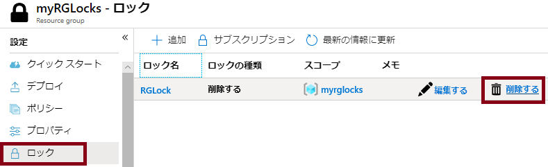

---
wts:
    title: '15 - リソース ロックの管理 (5 分)'
    module: 'モジュール 05: ID、ガバナンス、プライバシー、およびコンプライアンス機能に関する説明'
---
# 15 - リソース ロックの管理

このチュートリアルでは、リソース グループにロックをかけた後、リソース グループを削除できるかテストします。サブスクリプションにおいては、リソース グループ、または個々のリソースにロックをかけることで、重要なリソースが誤って削除または変更されるのを防ぐことができます。  

# タスク 1: リソース グループを作成する (5 分)

このタスクでは、この演習で使用するリソース グループを作成します。 

1. [Azure ポータル](https://portal.azure.com) にサインインします。

2. ポータルの一番上にある「**検索**」バーで「**リソース グループ**」を検索します。 

3. 次に、**「+ 追加」、「+ 新規」、「+ 作成」**をクリックします。 

    | 設定 | 値 |
    | -- | -- |
    | サブスクリプション | **サブスクリプションを使用する** |
    | 名前 | **myRGLocks** |
    | リージョン | **(米国) 米国東部** |
    

# タスク 2:  リソース グループにロックを追加し、削除をテストする

このタスクでは、リソース グループにリソース ロックを追加し、リソース グループの削除をテストします。 

1. Azure portal で、新しく作成した**myRGLocks** リソース グループに移動します。

2. サブスクリプション、リソース グループ、または個々のリソースにロックを適用して、重要なリソースが誤って削除または変更されるのを防ぐことができます。 

3. 「**設定**」 セクションの 「**ロック**」 をクリックし、「**+ 追加**」 をクリックします。 

    

4. 新しいロックを構成します。完了したら、「**OK**」 をクリックします。 

    | 設定 | 値 |
    | -- | -- |
    | ロック名 | **RGLock** |
    | ロックの種類 | **削除** |
    | | |

5. 「**概要**」をクリックし、「**リソース グループの削除**」 をクリックします。リソース グループの名前を入力し、「**OK**」 をクリックします。リソース グループがロックされ、削除できないことを示すエラー メッセージが表示されます。

    

# タスク 3: リソース グループのメンバーの削除をテストする

このタスクでは、リソース ロックがリソース グループのストレージ アカウントを保護するかどうかをテストします。 

1. 「**すべてのサービス**」 ブレードで 「**ストレージ アカウント**」 を検索して選択し、**「+ 追加」、「+ 作成」、「+ 新規」** のいずれかをクリックします。 

2. 「**ストレージ アカウント**」 ページの **「+ 追加」、「+ 作成」、「+ 新規」** のいずれかのブレードで、次の情報を入力します (ストレージ アカウントの名前の **xxxx** は、名前がグローバルに一意になるように文字と数字に置き換えます)。その他は既定値のままにします。

    | 設定 | 値 | 
    | --- | --- |
    | サブスクリプション | **サブスクリプションを選択します** |
    | リソース グループ | **myRGLocks** |
    | ストレージ アカウント名 | **storageaccountxxxx** |
    | 場所 | **(米国) 米国東部**  |
    | 業績 | **Standard** |
    | アカウントの種類 | **StorageV2 (汎用 v2)** |
    | レプリケーション | **ローカル冗長ストレージ (LRS)** |
    | アクセス層 (既定) | **ホット** |
   

3. 「**確認および作成**」 をクリックして、ストレージ アカウントの設定を確認し、Azure が構成を検証できるようにします。 

4. 検証できたら、 「**作成**」 をクリックしますアカウントが正常に作成されたことを示す通知を待ちます。 

5.  ストレージ アカウントが正常に作成されたことを示す通知を待ちます。 

6. 新しいストレージ アカウントにアクセスし、 「**概要**」 ウィンドウで 「**削除**」 をクリックします。リソースまたはその親のリソースの削除がロックされていることを示すエラー メッセージが表示されます。 

    

    **注**: ストレージ アカウント専用のロックは作成しませんでしたが、ストレージ アカウントを含むリソース グループ レベルでロックを作成しました。このように、この*親*レベルのロックによりリソースを削除できなくなり、ストレージ アカウントは親からロックを継承します。

# タスク 4: リソース ロックを解除する

このタスクでは、リソースロックを解除してテストします。 

1. 「**myRGLocks-XXXXXXXX**」 リソース グループ ブレードに戻り、「**設定**」 セクションで 「**ロック**」 をクリックします。
    
2. 「**myRGLocks-XXXXXXXX**」エントリの右端（ 「**編集**」 の右側）にある 「**削除**」 リンクをクリックします。

    

3. ストレージ アカウント ブレードに戻り、リソースを削除できるようになったことを確認します。

お疲れさまでした。リソース グループを作成し、リソース グループにロックを追加して削除をテストし、リソース グループ内のリソースの削除をテストし、リソース ロックを削除しました。 

**注**: 追加コストを回避するには、このリソース グループを削除します。リソース グループを検索し、リソース グループをクリックして、「**リソース グループの削除**」 をクリックします。リソース グループの名前を確認し、「**削除**」 をクリックします。**通知**を監視して、削除の進行状況を確認します。
