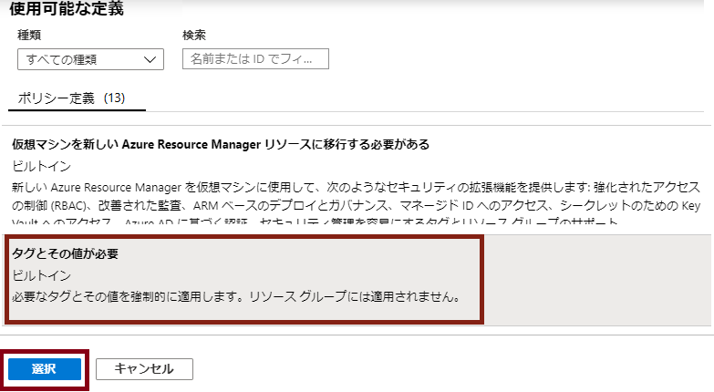
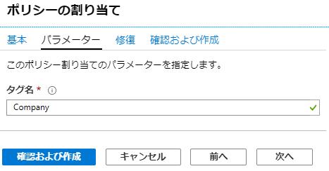
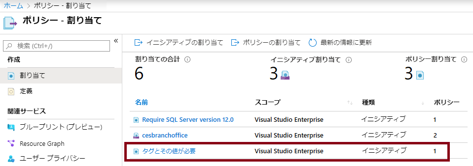
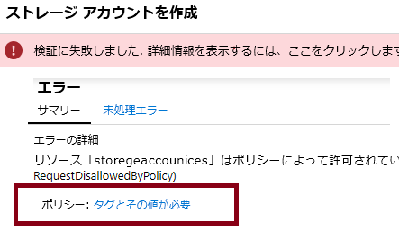
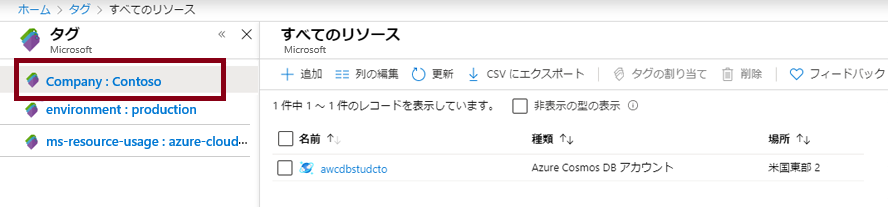
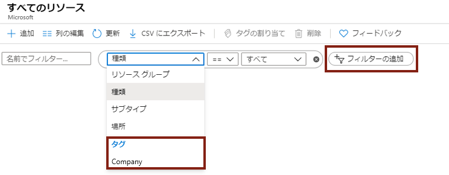

---
wts:
    title: '16 - リソースのタグ付けを実装する (5 分)'
    module: 'モジュール 05: ID、ガバナンス、プライバシー、およびコンプライアンス機能に関する説明'
---
# 16 - リソースのタグ付けを実装する

このチュートリアルでは、タグ付けが必要なポリシー割り当てを作成し、ストレージ アカウントを作成してタグ付けをテストし、指定したタグを持つリソースを表示し、タグ付けポリシーを削除します。

# タスク 1: ポリシー割り当てを作成する 

このタスクでは、「**リソースでタグを必須にする**」 ポリシーを構成して、そのポリシーにサブスクリプションを割り当てます。 

1. [Azure ポータル](https://portal.azure.com) にサインインします。

2. 「**すべてのサービス**」 ブレードで、「**ポリシー**」 を検索して選択します。

3. 「**作成**」 セクションにスクロールして 「**割り当て**」 をクリックし、ページ上部の 「**ポリシーの割り当て**」 をクリックします。

4. ポリシーの**範囲**はサブスクリプション全体になります。 

5. 「**基本**」 で、（テキスト ボックス右側にある）「**ポリシー定義**」省略記号ボタンを選択します。 「**検索**」 ボックスに 「**tag**」 と入力します。 「**tag**」 という文字が含まれる関連ポリシーの一覧が表示されます。「**リソースでタグを必須にする**」定義が現れるまで下にスクロールし、見つかったらそれをクリックして、「**選択**」をクリックします。

   
   
6. 「**パラメーター**」 タブで、タグ名に 「**Company**」と入力します。値には 「**Contoso**」 と入力します。 「**確認および作成**」 をクリックし、「**作成**」をクリックします。

    

7. 「**リソースでタグを必須にする**」 ポリシーの割り当てが適用されました。リソースを作成する場合、Company キーを持つタグを含める必要があります。
   **注 - ポリシーが適用されるまで最大 30 分待つ必要があります。** 

   

# タスク 2: ストレージアカウントを作成して、必要なタグ付けをテストする

このタスクでは、ストレージ アカウントを作成して、必要なタグ付けをテストします。 

1. Azure Portal の「**すべてのサービス**」ブレードで、「**ストレージ アカウント**」を検索して選択し、**「+ 追加」、「+ 作成」、「+ 新規」** をクリックします。

2. 「**ストレージ アカウントの作成**」 ブレードの 「**基本**」 タブで次の情報を入力します (ストレージ アカウントの名前の **xxxx** は、名前がグローバルに一意になるように文字と数字に置き換えます)。その他は既定値のままにします。

    | 設定 | 値 | 
    | --- | --- |
    | サブスクリプション | **提供されている既定値を使用** |
    | リソース グループ | **新しいリソース グループの作成** |
    | ストレージ アカウント名 | **storageaccountxxxx** |
    | 場所 | **(米国) 米国東部** |

3. 「**確認および作成**」をクリックします。 

    **注:** タグが提供されない場合に何が起こるかをテストします。ポリシーが有効になるまで最大 30 分かかる場合があることに注意してください。

4. 次の確認失敗メッセージが表示されます。 「**ここをクリックして詳細を表示**」 メッセージをクリックします。 「**エラー**」 ブレードの 「**概要**」 タブで、ポリシーによりリソースが許可されていないことを示すエラー メッセージを書き留めます。

    **注記:** 「未処理エラー」タブを表示すると、必要な特定のタグ名が表示されます。 

    

5. 「**エラー**」ペインを閉じ、画面の下部にある 「**前へ**」 をクリックします。タグ付け情報を入力します。 

    | 設定 | 値 | 
    | --- | --- |
    | タグ名 | **Company** (ドロップダウン リストにない可能性があります) |

6. 「**確認および作成**」 をクリックし、検証が成功したことを確認します。 「**作成**」 をクリックしてストレージ アカウントをデプロイします。 

# タスク 3: 特定のタグを持つすべてのリソースを表示します

1. Azure Portal の 「**すべてのサービス**」 ブレードで、「**タグ**」 を検索して選択します。

2. すべてのタグとその値を書き留めます。「**Company : Contoso**」キー/値のペアをクリックします。これにより、デプロイにおいてタグが含まれていれば、新しく作成したストレージ アカウントを示すブレードが表示されます。 

   

3. ポータルで、「**すべてのリソース**」ブレードを表示します。

4. 「**フィルターの追加**」をクリックし、フィルターのカテゴリとして **Company** タグ キーを追加します。フィルターが適用されると、自分のストレージ アカウントのみがリストされます。

    

# タスク 4: ポリシーの割り当てを削除する

このタスクでは、「**リソースでタグを必須にする**」ポリシーを削除して、今後の作業に影響が及ばないようにします。 

1. ポータルの「**すべてのサービス**」 ブレードで、「**ポリシー**」 を検索して選択します。

2. 「**リソースでタグを必須にする**」 ポリシー エントリをクリックします。

3. 上部メニューから 「**割り当ての削除**」 をクリックします。

4. 「**はい**」 をクリックして、「**割り当ての削除**」 ダイアログでポリシー割り当てを削除できることを確認します。

5. 時間があれば、タグなしで別のリソースを作成し、ポリシーが適用されていないことを確認してください。

お疲れさまでした! このチュートリアルでは、タグ付けが必要なポリシー割り当てを作成し、リソース (ストレージ アカウント) を作成して、タグ付けのポリシーをテストし、指定されたタグでリソースを表示し、タグ付けポリシーを削除しました。

**注**: 追加コストを回避するために、オプションでこのリソース グループを削除できます。リソース グループを検索し、リソース グループをクリックして、「**リソース グループの削除**」をクリックします。リソース グループの名前を確認し、「**削除**」をクリックします。**通知**を監視して、削除の進行状況を確認します。
