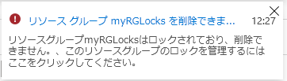
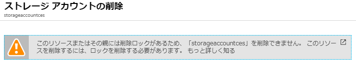

---
wts:
    title: '16 - リソース ロックの管理'
    module: 'モジュール 03 - セキュリティ、プライバシー、コンプライアンス、および信頼性'
---
# 16 - リソース ロックの管理

このチュートリアルでは、リソース グループを作成し、リソース グループにロックを追加して削除をテストし、リソース グループ内のリソースの削除をテストし、リソース ロックを削除します。 

推定時間: 15 分

# タスク 1: リソース グループを作成する

このタスクでは、この演習のリソース グループを作成します。 

1. [Azure Portal](https://portal.azure.com) にサインインします。

2. [**リソース グループ**] を検索して選択し、[**+ 追加**] を選択します。

3. 新しいリソース グループを構成します。完了したら、[**確認および作成**] をクリックし、[**作成**] をクリックします。 

    | 設定 | 値 |
    | -- | -- |
    | サブスクリプション | **サブスクリプションを使用する** |
    | 名前 | **myRGLocks** |
    | リージョン | **(US) 米国東部** |
    | | |

# タスク 2:  リソース グループにロックを追加し、削除をテストする

このタスクでは、リソース グループにリソース ロックを追加し、リソース グループの削除をテストします。 

1. 新しいリソース グループ **myRGLocks** にアクセスします。 

2. 管理者は、サブスクリプション、リソース グループ、または個々のリソースを **ロック** し、組織の他のユーザーが誤って重要なリソースを削除したり変更したりするのを防止しなければならないことがあります。 

3. [**設定**] の [**ロック**] をクリックし、[**+ 追加**] をクリックします。 

    ![[ロック] ウィンドウが表示されている locksrg リソース グループのスクリーンショット。](../images/1601.png)

4. 新しいロックを構成します。完了したら、[**OK**] をクリックします。 

    | 設定 | 値 |
    | -- | -- |
    | ロック名 | **RGLock** |
    | ロックの種類 | **Delete** |
    | | |

5. リソースグループの [**概要**] ブレードを選択し、[**リソースグループの削除**] を選択します。リソース グループの名前を確認し、[**OK**] をクリックします。リソース グループがロックされ、削除できないことを示すエラー メッセージが表示されます。

    

# タスク 3: リソース グループのメンバーの削除をテストする

このタスクでは、リソース ロックがリソース グループのストレージ アカウントを保護するかどうかをテストします。 

1. **Container Instances** を検索して、[**+ 追加**] をクリックします。 

2. ストレージ アカウントを構成し、[**確認および作成**] を選択 して、[**作成**] をクリックします。

    | 設定 | 値 | 
    | --- | --- |
    | サブスクリプション | **サブスクリプションを選択します** |
    | リソース グループ | **myRGLocks** |
    | ストレージ アカウント名 | **storageaccountxxx** (一意である必要があります) |
    | 場所 | **(US) 米国東部**  |
    | パフォーマンス | **標準** |
    | アカウントの種類 | **StorageV2 (汎用 v2)** |
    | レプリケーション | **ローカル冗長ストレージ (LRS)** |
    | アクセス層 (既定) | **ホット** |
    | | |

3.  ストロアージ アカウントが正常に作成されたことを示す通知を待ちます。 

4. 新しいストレージ アカウントにアクセスし、[**概要**] ウィンドウで [**削除**] をクリックします。リソースまたはその親が削除ロックを持っていることを示すエラー メッセージが表示されます。 

    

    **注記**: ストレージ アカウント専用のロックは作成しませんでしたが、ストレージ アカウントを含むリソース グループ レベルでロックを作成しました。このように、この *親* レベルのロックによりリソースを削除できなくなるため、ストレージ アカウントは親からロックを継承します。

# タスク 4: リソース ロックを解除する

このタスクでは、リソースロックを解除してテストします。 

1. リソース グループに戻り、[**設定**] で [**ロック**] を選択します。
    
2. ロックで [**削除**] を選択します。  

    ![[削除] アイコンが強調表示されたロックのスクリーンショット。](../images/1604.png)

3. ストレージ アカウントに戻り、リソースを削除できることを確認します。

お疲れさまでした。リソース グループを作成し、リソース グループにロックを追加して削除をテストし、リソース グループ内のリソースの削除をテストし、リソース ロックを削除しました。 

**注記**: 追加コストを回避するには、このリソース グループを削除します。リソース グループを検索し、リソース グループをクリックして、[**リソース グループの削除**] をクリックします。リソース グループの名前を確認し、[**削除**] をクリックします。**通知** を監視して、削除の進行状況を確認します。