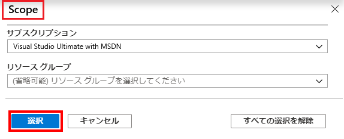
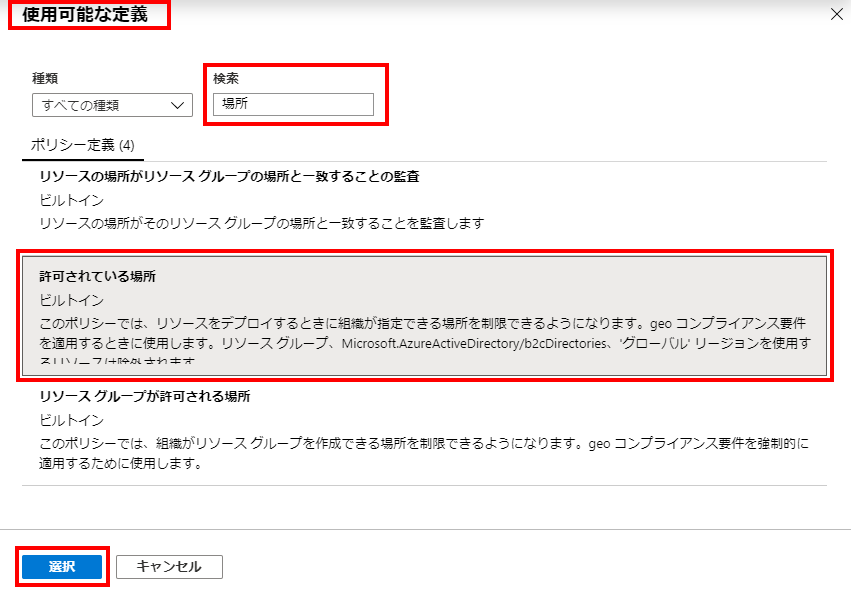
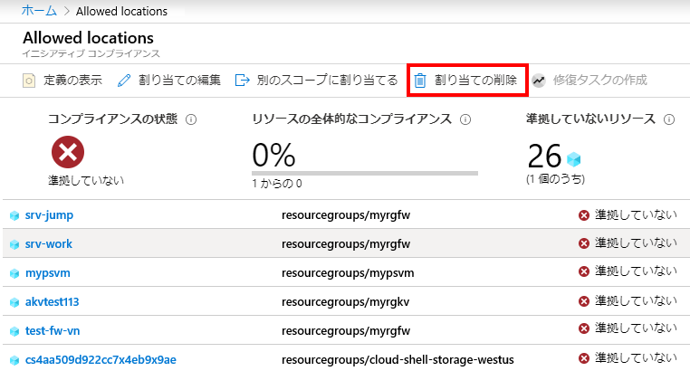

---
wts:
    title: '17 - Azure Policy の作成 (10 分)'
    module: 'モジュール 05: ID、ガバナンス、プライバシー、およびコンプライアンス機能に関する説明'
---
# 17 - Azure Policy の作成 (10 分)

このチュートリアルでは、Azure リソースのデプロイを特定の場所に制限する Azure Policy を作成します。

# タスク 1: ポリシー割り当てを作成する 

このタスクでは、許可されている場所のポリシーを構成し、サブスクリプションに割り当てます。 

1. Azure portal　(`https://portal.azure.com`) にサインインします。

2. 「**すべてのサービス**」ブレードで、「**ポリシー**」を検索して選択し、「**作成**」セクションで「**定義**」をクリックします。  組み込みのポリシー定義の一覧を確認します。たとえば、「**カテゴリ**」ドロップダウンで「**計算**」のみを選択します。「**許可された仮想マシン サイズ SKU**」定義により、自分の組織がデプロイできる仮想マシン SKU のセットを指定できます。

3. 「**ポリシー**」 ページに戻り、「**作成**」 セクションの「**割り当て**」をクリックします。割り当ては、特定のスコープ内で実行するように割り当てられたポリシーです。たとえば、サブスクリプションのスコープに定義を割り当てることができます。 

4. 「**ポリシー - 割り当て**」 ページの上部の「**ポリシーの割り当て**」をクリックします。

5. 「**ポリシーの割り当て**」ページで、既定のスコープを維持します。

      | 設定 | 値 | 
    | --- | --- |
    | スコープ| **選択された既定値を使用**|
    | ポリシー定義 | 楕円をクリックし、「**許可されている場所**」を検索して、「**選択**」をクリックする |
    | 割り当て名 | **許可されている場所** |
    
    
6. 「**パラメーター**」タブで、「**日本西部**」を選択します。「**確認および作成**」をクリックし、「**作成**」をクリックします。

    **注**: スコープによって、ポリシーの割り当てが適用されるリソース、またはリソースのグループが決まります。このポリシーを特定のリソース グループに割り当てることができますが、ポリシーをサブスクリプション レベルで割り当てることもできます。スコープの構成によって、リソースが除外される場合があることにご注意ください。除外はオプションです。

    **注**: この「**許可されている場所**」ポリシー定義では、すべてのリソースがデプロイされる場所を指定します。別の場所が選択されている場合、デプロイは許可されません。詳細については、[Azure Policy Samples](https://docs.microsoft.com/ja-jp/azure/governance/policy/samples/index) ページをご覧ください。

   

9. 「**許可されている場所**」ポリシーの割り当てが「**ポリシー - 割り当て**」ペインにリストされて適用されます。指定したスコープ レベル (サブスクリプション レベル) でポリシーが適用されます。

# タスク 2: 許可されている場所のポリシーをテストする

このタスクでは、許可されている場所のポリシーをテストします。 

1. Azure Portal の **「すべてのサービス」** ブレードで、**「ストレージ アカウント」** を検索して選択し、**「+ 作成」** をクリックします。

2. ストレージ アカウントを構成します (ストレージ アカウント名の **xxxx** は、名前がグローバルに一意になる文字と数字に置き換えます)。その他は既定値のままにします。 

    | 設定 | 値 | 
    | --- | --- |
    | サブスクリプション | **提供されている既定値を使用** |
    | リソース グループ | **myRGPolicy** (新規作成) |
    | ストレージ アカウント名 | **storageaccountxxxx** |
    | 場所 | **(米国) 米国東部** |

3. 「**確認および作成**」 をクリックしてから 「**作成**」 をクリックします。 

4. 「**許可されている場所**」ポリシー名を含む、リソースがポリシーにより許可されないことを示す**デプロイ失敗**エラーが表示されます。

# タスク 3: ポリシーの割り当てを削除する

このタスクでは、許可されている場所のポリシーの割り当てを削除してテストします。 

ポリシーの割り当てを削除して、今後の作業がブロックされないようにします。

1. 「**すべてのサービス**」 ブレードで、「**ポリシー**」 を検索して選択し、「**許可されている場所**」 ポリシーをクリックします。

    **注**: 「**ポリシー**」 ブレードで、割り当てたさまざまなポリシーのコンプライアンス状態を表示することができます。

    **注**: 「許可されている場所」ポリシーに、正しくないリソースが表示される場合があります。それらはポリシーを割り当てる前に作成されたリソースです。
 
2. 「**許可されている場所**」をクリックします。「許可されている場所のポリシー コンプライアンス」ウィンドウが開きます。

3. 上部メニューから「**割り当ての削除**」をクリックします。「**はい**」をクリックして、ポリシー割り当てを削除することを確認します

   

4. 別のストレージ アカウントを作成して、ポリシーが無効になっていることを確認してください。

    **注**: 「**許可されている場所**」 ポリシーが役立つ一般的なシナリオには以下のようなものがあります: 
    - *コスト トラッキング*: リージョンの場所ごとに、サブスクリプションが異なる場合があります。このポリシーにより、すべてのリソースが対象のリージョンにデプロイされるようにし、コスト トラッキングを行うことができます。 
    - *データ常駐とセキュリティ コンプライアンス*: データ常駐要件を設定し、顧客ごとまたは特定のワークロードごとにサブスクリプションを作成し、すべてのリソースを特定のデータセンターにデプロイしてデータとセキュリティのコンプライアンス要件を確保することを定義することもできます。

お疲れさまでした。Azure リソースの展開を特定のデータセンターに制限する Azure Policy を作成しました。

**注**: 追加コストを回避するために、オプションでこのリソース グループを削除できます。リソース グループを検索し、リソース グループをクリックして、「**リソース グループの削除**」をクリックします。リソース グループの名前を確認し、「**削除**」をクリックします。**通知**を監視して、削除の進行状況を確認します。
