---
wts:
    title: '19 - Azure 料金計算ツールを使用する (10 分)'
    module: 'モジュール 06: Azure Cost Management およびサービス レベル アグリーメントに関する説明'
---
# 19 - 料金計算ツールを使用する (10 分)

このチュートリアルでは、Azure 料金計算ツールを使用して、Azure 仮想マシンおよび関連するネットワーク リソースのコスト見積もりを作成します。

# タスク 1: 料金計算ツールについて理解する

このタスクでは、Azure 料金計算ツールを使用してサンプルのインフラストラクチャのコストを見積もります。 

**注**: このチュートリアルでは、Azure 料金計算ツールの見積もりを作成するために、VM および関連リソースの構成例を示します。この構成例を使用するか、または Azure 料金計算ツールに自分の *実際の* リソース要件に関する詳細を入力します。 

1. ブラウザーで、Azure [料金計算ツール](https://azure.microsoft.com/ja-jp/pricing/calculator/)の Web ページに移動します。

2. VM 構成の詳細を追加するには、**「製品」** タブの **「仮想マシン」** をクリックします。下にスクロールして、仮想マシンの詳細を表示します。 

3. **「見積もり」** と **「仮想マシン」** テキストに、Azure 料金計算ツールの見積もりと VM 構成に関するより詳細な記述名を入力します。このチュートリアルの例では、見積もりの名前に「**料金計算ツールの見積もり**」、VM 構成の名前に「**Windows VM**」を使用します。

   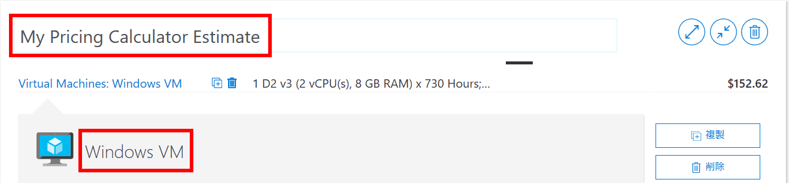

4. 既定の VM 構成を変更します。

    | 設定 | 値 |
    | -- | -- |
    | リージョン | **北ヨーロッパ** |
    | オペレーティング システム | **Windows** |
    | 種類 | **(OS のみ)** |
    | 階層 | **標準** |  
    | インスタンス | **A2: 2 コア、3.5 GB RAM、135 GB の一時記憶域** |

   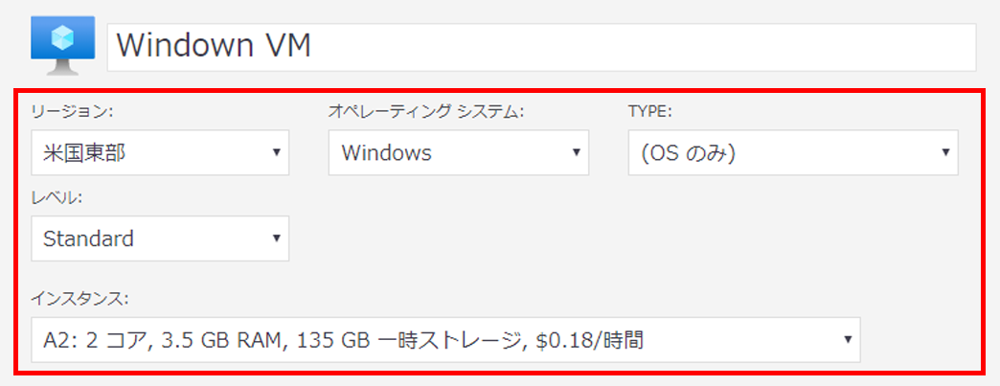

    **注**: VM インスタンスの仕様と価格は、この例の仕様と異なる場合があります。このチュートリアルでは、例にできるだけ近いインスタンスを選択します。さまざまな VM 製品オプションの詳細を表示するには、右側の 「**詳細情報**」 メニューの 「**製品の詳細**」 を選択します。

5. 「**課金オプション**」 を 「**従量課金制**」 に設定します。

   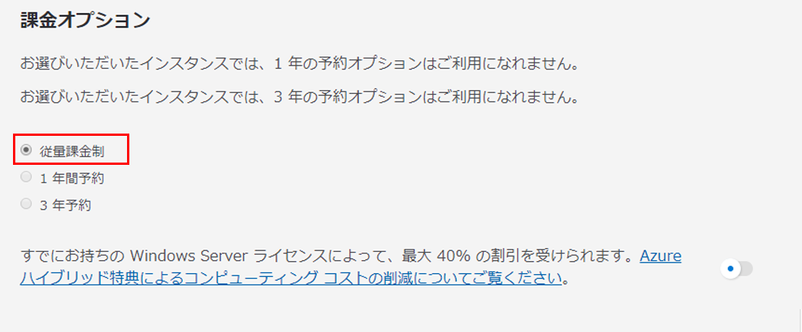

6. Azure では、1 か月は 730 時間と定義されています。各月において VM が100 パーセント利用可能である必要がある場合、月あたりの時間の値を`730`に設定します。このチュートリアルの例では、各月における VM 1 台あたりの利用可能状況が 50 パーセントになっています。

    VM の数を`1`に設定したままにして、月の時間の値を`365`に変更します。

   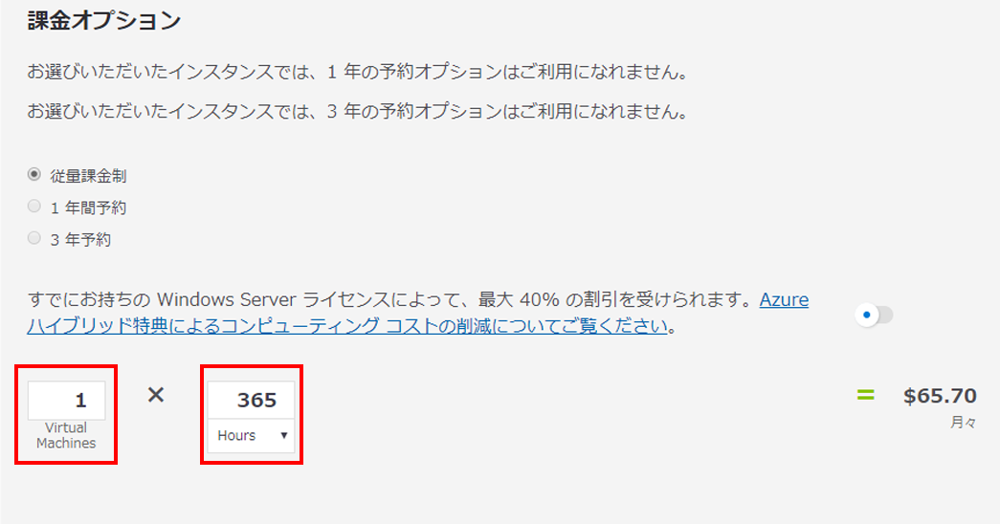

7. 「**管理 OS ディスク**」 で、既定の VM 記憶域の構成を変更します。

    | 階層 | ディスク サイズ | ディスクの数 | スナップショット | ストレージ トランザクション |
    | ---- | --------- | --------------- | -------- | -------------------- |
    | 標準 HDD | S30: 1024 GB | 1 | オフ | 10,000 |

   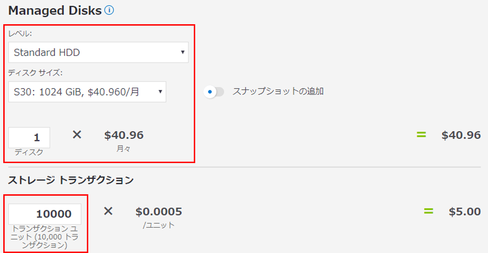

8. 見積もりにネットワーク帯域幅を追加するには、Azure 料金計算ツール Web ページの上部に移動します。左側の製品メニューから **「ネットワーク」** をクリックし、**「帯域幅」** タイルをクリックします。**「追加済み帯域幅」** メッセージ ダイアログで、**「表示」** をクリックします。

   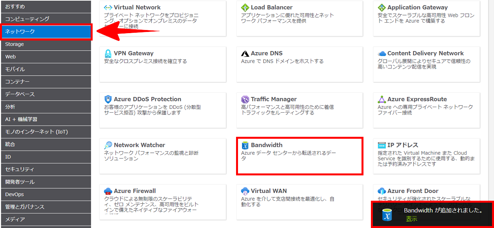

9. VM 帯域幅の構成の名前を追加します。このチュートリアルの例では、「**Bandwidth: Windows VM**」という名前を使用します。次の詳細を追加して、既定の帯域幅の構成を変更します。

    | リージョン | ゾーン 1 送信データ転送 |
    | ------ | -------------------------------------- |
    | 北ヨーロッパ | 50 GB |

   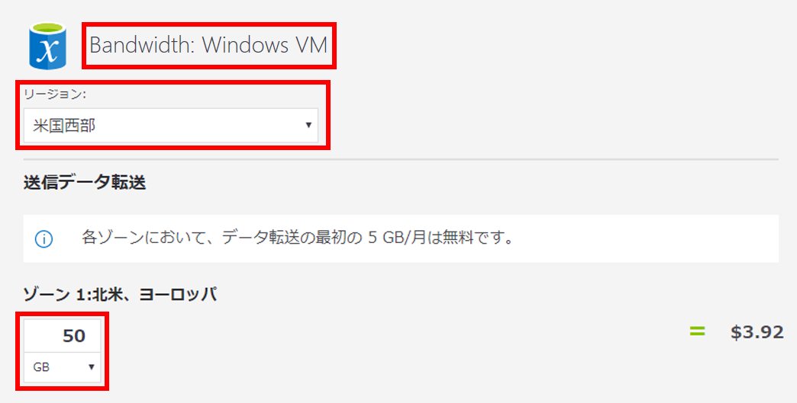

10. Application Gateway を追加するには、Azure 料金計算ツール Web ページの上部に戻ります。**「ネットワーク」** 製品メニューで、**「Application Gateway」** タイルをクリックします。**「Application Gateway」** メッセージ ダイアログで、**「表示」** をクリックします。

    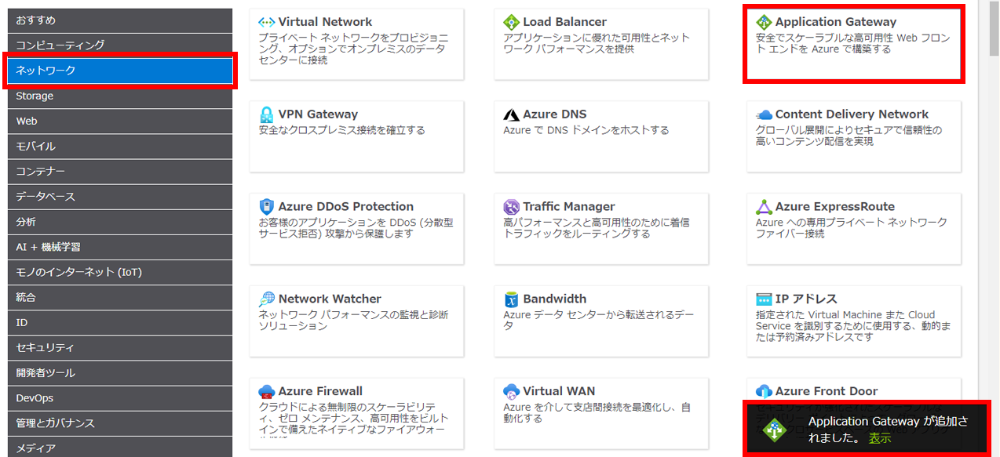

11. Application Gateway の構成の名前を追加します。このチュートリアルでは、「**App Gateway: Windows VM**」という名前を使用します。次の詳細を追加して、既定の Application Gateway 構成を変更します。

    | 設定 | 値 |
    | -- | -- |
    | リージョン | **北ヨーロッパ** |
    | 階層 | **基本** |
    | サイズ | **Small** |
    | インスタンス | **1** |  
    | 時間 | **365** |
    | データ処理量 | **50 GB** |
    | ゾーン 1: 北米、ヨーロッパ | **50 GB**|

    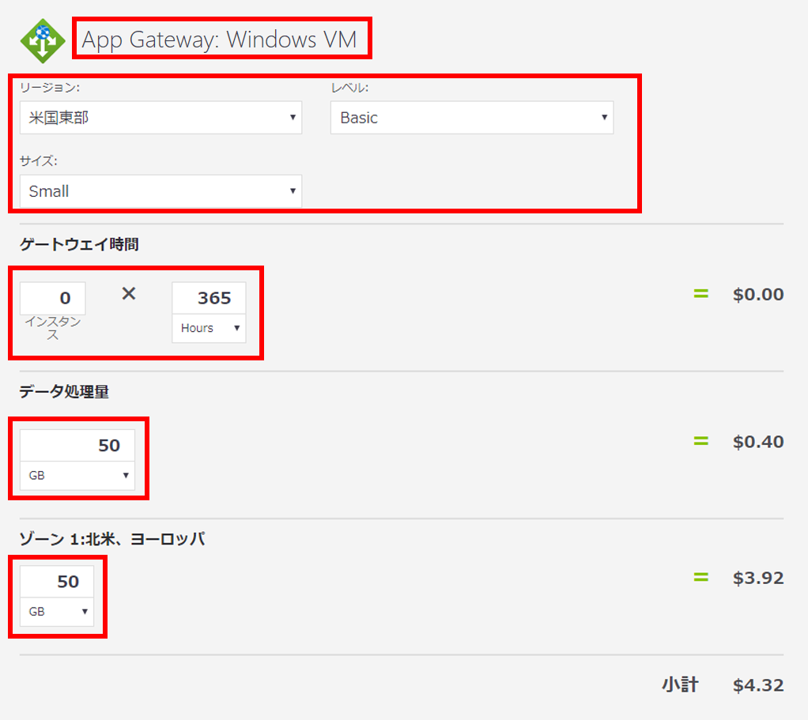

# タスク 2: 料金の見積もりを確認する

このタスクでは、Azure 料金計算ツールの結果を確認します。 

1. Azure 料金計算ツール Web ページの最下部にスクロールし、合計 **「推定月額費用」** を表示します。

    **注**: Azure 料金計算ツールで使用できるさまざまなオプションについて説明します。たとえば、このチュートリアルでは、通貨をユーロに更新する必要があります。

2. 通貨をユーロに変更し、「**エクスポート**」 を選択して、Microsoft Excel (`.xlsx`) 形式でオフラインで表示するために見積もりのコピーをダウンロードします。

    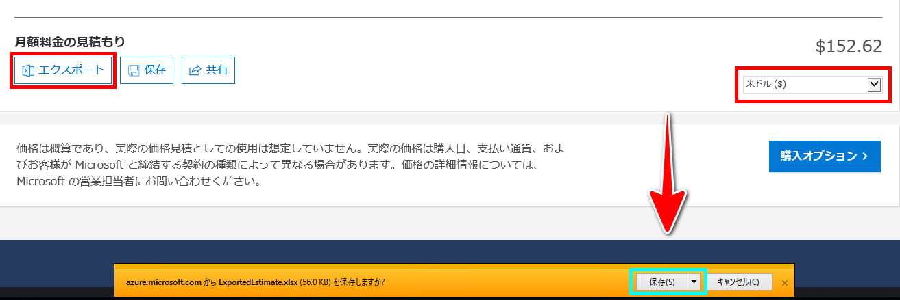

    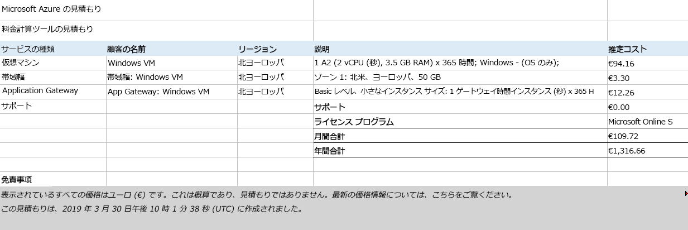

成功しました。Azure 料金計算ツールから見積もりをダウンロードしました。
