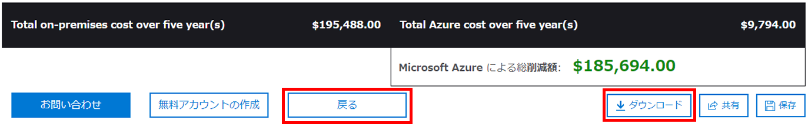

---
wts:
    title: '20 - Azure TCO 計算ツールを使用する (10 分)'
    module: 'モジュール 06: Azure Cost Management およびサービス レベル アグリーメントに関する説明'
---
# 20 - Azure TCO 計算ツールを使用する

このチュートリアルでは、総保有コスト (TCO) 計算ツールを使用して、オンプレミス環境とのコスト比較レポートを作成します。

**注**: このチュートリアルでは、一般的なデータセンターのオンプレミス インフラストラクチャとワークロードの定義例を示します。TCO 計算ツール レポートを作成するには、定義例を使用するか、*実際の*オンプレミス インフラストラクチャとワークロードの詳細を入力します。

# タスク 1: TCO 計算ツールを構成する (10 分)

このタスクでは、計算ツールにインフラストラクチャ情報を追加します。 

1. ブラウザーで、[総保有コスト (TCO) 計算ツール](https://azure.microsoft.com/ja-jp/pricing/tco/calculator/) ページに移動します。

2. オンプレミスのサーバー インフラストラクチャに関する詳細を追加するには、**「ワークロードの定義」** ペインの **「+ サーバー ワークロードの追加」** をクリックします。

    | 設定 | 値 |
    | -- | -- |
    | 名前 | **サーバー: Windows VM** |
    | ワークロード | **Windows / Linux サーバー** |
    | 環境 | **仮想マシン** |
    | オペレーティング システム | **Windows** |  
    | VM | **50** |
    | 仮想化 | **Hyper-V** |
    | コア | **8**|
    | RAM (GB) | **16** |
    | 最適化の方法 | **CPU** |
    | Windows Server 2008/2008 R2 | **オフ** |
    | | |

3. 「**+ サーバー ワークロードの追加**」 を選択して、新しいサーバー ワークロード定義の行を作成します。 

    | 設定 | 値 |
    | -- | -- |
    | 名前 | **サーバー: Linux VM** |
    | ワークロード | **Windows / Linux サーバー** |
    | 環境 | **仮想マシン** |
    | オペレーティング システム | **Linux** |  
    | VM | **50** |
    | 仮想化 | **VMware** |
    | コア | **8**|
    | RAM (GB) | **16** |
    | 最適化の方法 | **CPU** |
    | Windows Server 2008/2008 R2 | **オフ** |
    | | |

4. 「**ストレージ**」 ウィンドウで、「**記憶域の追加**」 をクリックします。

    | 設定 | 値 |
    | -- | -- |
    | 名前 | **サーバー ストレージ** |
    | ストレージの種類 | **ローカル ディスク/SAN** |
    | ディスクの種類 | **HDD** |
    | 容量 | **60 TB** |  
    | バックアップ | **120 TB** |
    | アーカイブ | **0 TB** |
    | | |

5. 「**ネットワーク**」 ウィンドウで、帯域幅を追加します。 

    | 設定 | 値 |
    | -- | -- |
    | アウトバウンド帯域幅 | 15 TB|
    | | |

6. 「**次へ**」 をクリックします。

7. オプションを確認し、必要な調整を行います。 

    | 設定 | 値 |
    | -- | -- |
    | 通貨 | **ユーロ** |
    | | |

8. 「**次へ**」 をクリックします。

# タスク 2: 結果を確認し、コピーを保存する

このタスクでは、コスト削減の推奨事項を確認し、レポートをダウンロードします。 

1. Azure のコスト削減に関する推奨事項と視覚化を確認します。

    | 設定 | 値 |
    | -- | -- |
    | 期間| **3 年間** |
    | リージョン | **北ヨーロッパ** |
    | | |

2. 入力した情報を変更するには、ページの最下部にスクロールして **「戻る」** をクリックします。 

3. レポートの PDF コピーを保存または印刷するには、**「ダウンロード」** をクリックします。

    

成功しました。TCO 計算ツールを使用して、オンプレミス環境とのコスト比較レポートを作成しました。
