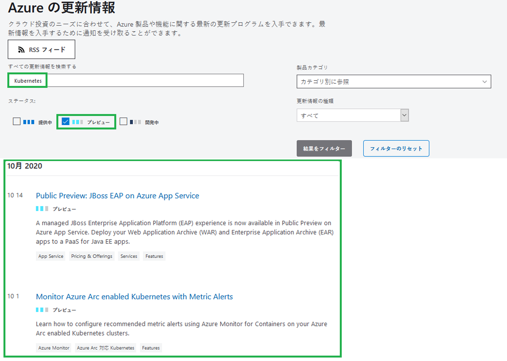

---
wts:
    title: '23 - Azureプレビュー機能にアクセスする'
    module: 'モジュール 04 - Azure の価格体系とサポート'
---

# 23 - Azureプレビュー機能にアクセスする

このチュートリアルでは、Azure プレビュー サービスと機能にアクセスして識別し、最新の Azure 更新情報を表示します。

推定時間: 10 分

# タスク 1: プレビュー サービスと機能にアクセスする

このタスクでは、マーケットプレース プレビュー機能について説明します。 

1. [Azure Portal](https://portal.azure.com) にサインインします。

2. [**マーケットプレース**] を検索して選択します。 

3. マーケットプレースで [**プレビュー**] を検索します。  興味のあるプレビュー製品を確認します。 

4. マーケットプレイスで **Kubernetes Service** を検索します。Kubernetes Service を選択し、[**作成**] をクリックします。

5. **Kubernetes Version** ドロップダウン通知には、**プレビュー** バージョンがあります。すべてのサービスにプレビュー版があるわけではありません。 

    ![[Kubernetes サービスの作成] ボタンが強調表示された [Azure Kubernetes Services] ウィンドウのスクリーンショット。](../images/2301.png)

    **注記**: これらのシナリオでは、既存の一般的に利用可能な Azure サービスまたは製品内で新しい機能が利用可能になりますが、運用で Azure サービスを使用している場合でも、プレビュー機能はまだ運用デプロイの準備ができていない可能性があります。また、運用環境にデプロイする前に、使用に関する制限事項を認識しておく必要があります。

# タスク 2: [Azure の更新情報] ページを確認する

このタスクでは、Azure の更新ページを確認します。

1. ブラウザーで、[Azure の更新](https://azure.microsoft.com/ja-jp/updates/) プログラム ページに移動します。  

2. 4 つのタブ オプション（[**すべて**]、[**利用可能**]、[**プレビュー**]、[**開発中**]）が存在します。

3. [**プレビュー中**] タブをクリックし、検索ボックスに [**Kubernetes**] と入力し、プロンプトが表示されたら [Azure Kubernetes Services (AKS)] を選択します。このページには、Kubernetes に関連するアイテムのリストがプレビューで返されます。結果リストが異なる場合があります。 

    

4. 結果リストの項目をクリックすると、より詳細な情報が表示されます。 

5. [**Azure の更新**] ページに戻り、[**利用可能になりました**] をクリックして現在表示されているアイテムに注目することで、ステータスが [**一般可用性**] になったアイテムを表示します。興味のある情報を参照します。

6. **Azure の更新** ページに戻り、[**開発中**] タブをクリックして、現在開発中の返されたアイテムをメモします。興味のある情報を参照します。

お疲れさまでした。Azure プレビュー サービスと機能にアクセスして識別し、最新の Azure 更新情報を表示しました。

